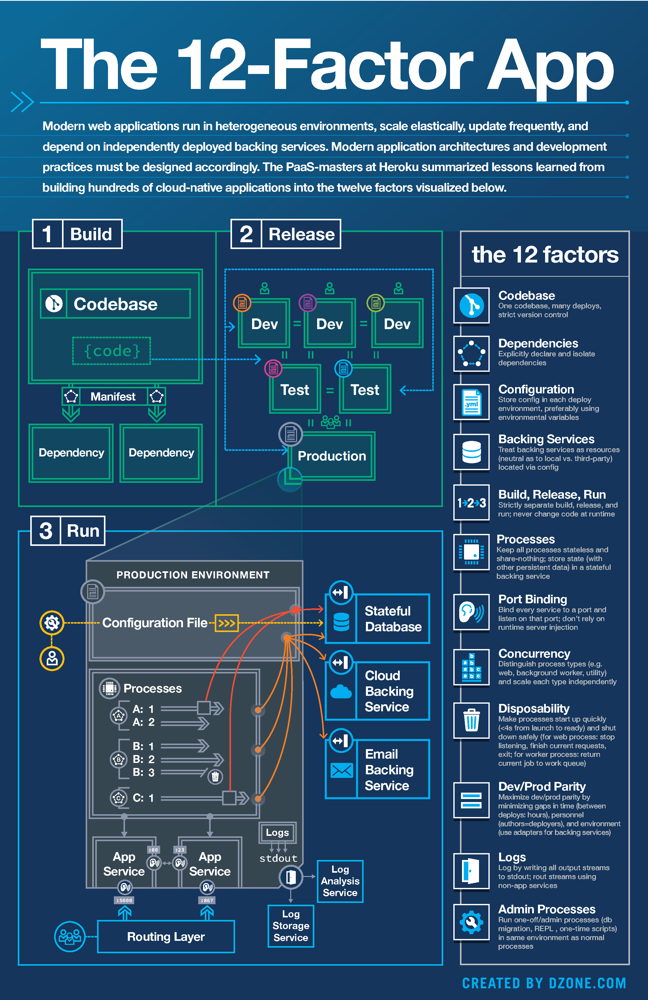
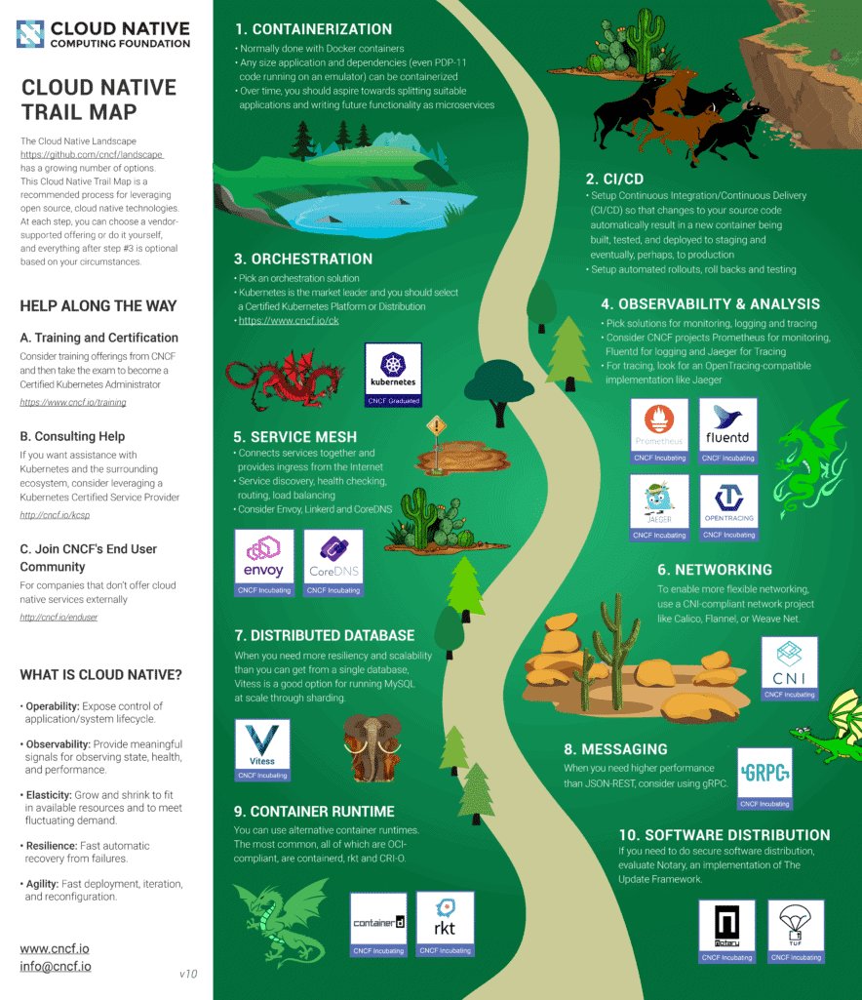
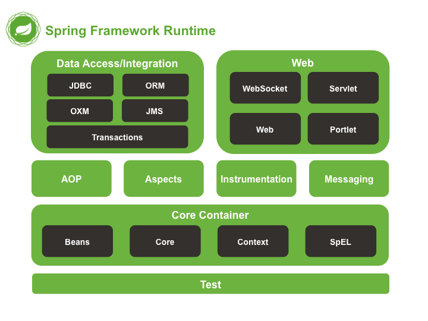

# 1 클라우드 네이티브

- 일반적으로 클라우드 네이티브란 클라우드 컴퓨팅을 활용하여 "**퍼블릭, 프라이빗 및 하이브리드 클라우드와 같은 현대적이고 동적인 환경에서 확장 가능한 애플리케이션 을 구축하고 실행**" 하는 소프트웨어 개발 방식을 의미한다.
- 2015년에 창설된 리눅스 재단 산하의 오픈소스 운영 기구로, 클라우드 네이티브 애플리케이션을 위한 다양한 오픈소스 프로젝트들을 주도하여 진행하는 CNCF(Cloud Native Computing Foundation)에서는 클라우드 네이티브를, **컨테이너화 가능한 오픈소스 소프트웨어 스택을 사용**하는 것을 의미한다고 정리하고 있다.
- 이러한 클라우드 네이티브를 기반으로 개발된 애플리케이션들은 **선언적 코드를 통해 배포되는 컨테이너(Container), 마이크로서비스(Microservice), 서버리스(Serverless) 기능 및 불변의 인프라(Immutable Infrastructure)와 같은 공통 기술 요소들을 포함** 하고 있다.
- 클라우드 네이티브 애플리케이션은 **상호운용성과 이식성을 향상** 시킬 수 있는 여러 가지 특징을 지니고 있다.

  

## 1.1 클라우드 네이티브 기술 특징

### 1.1.1  Container

- **클라우드 네이티브 애플리케이션을 위하 여 필수적으로 가장 먼저 도입 해야하는 기술은 컨테이너 기술**이라고 할 수 있다. 
- 컨테이너는 기존 클라우드 환경에서 많이 활용되는 가상 머신(Virtual Machine)처럼 애플리케이션과 관련된 라이브러리나 종속되는 항목들을 패키지로 묶어 서비스 구동을 위한 격리된 환경을 제공한다는 점에서 유사한 점이 있다. 
- **가상머신은 하드웨어 자원을** **하이퍼바이져라는 미들웨어를 통해 가상화시켜 가상화된 컴퓨팅 자원을 제공**하는 반면, **컨테이너는 운영체제 수준에서 가상화를 수행하여 다수의 컨테이너를 운영체제 커널에서 직접 구동**한다. 
- **컨테이너는 운영체제 커널을 공유**하여 훨씬 **가볍고 구동이 빠르며, 운영체제 전체 부팅보다 메모리를 훨씬 적게 차지**하게 된다.
- 컨테이너 기술은 운영체제와 독립적으로 분리되어 애플리케이션을 실행할 수 있도록 지원하므로, 동일한 **컨테이너 런타임만 사용한다면 어떤 클라우드 환경에서든 컨테이너를 자유롭게 이식**하여 실행시킬 수 있다.


 

가상머신 VS 컨테이너


### 1.1.2  Docker 

- 가상머신 체계에서 가상화를 위해 하이퍼바이져가 하는 역할을 컨테이너 체계에서는 컨테이너 런타임이 한다고 볼 수 있다. 

- 컨테이너 생성 및 실행을 위한 다양한 컨테이너 런타임이 존재하며 그 중에서도 Docker는 최근까지도 많이 활용되고 있는 오픈소스 기술이다.

- Docker는 **컨테이너 정보를 Dockerfile로 관리**하고 이 코드를 기반으로 컨테이너 이미지의 복제 및 애플리케이션 배포가 이루어지기 때문에 애플리케이션을 쉽게 다시 빌드하고 배포할 수 있다. 
  
  -  Docker는 이미지 버전 관리, 레이어 구조를 갖는 이미지 포맷 제공, 도커 이미지 레지스트리, 프로그램이 가능한 다양한 기능의 API를 제공하는 등의 특징을 가지고 있다.
  
- 동일한 컨테이너 런타임 환경에서는 컨테이너의 이식이 자유롭게 가능하므로 Docker와 같은 활용도가 높은 컨테이너 런타임을 적용하면 이식성을 향상 시킬 수 있다.

  

### 1.1.3 Podman

-  2017년에 Docker가 엔터프라이즈 버전을 상용화하면서 레드햇은 또다른 컨테이너 오픈소스 기술인 Podman을 사용하여 레드햇의 엔터프라이즈 제품들을 출시하였다. 
- 2019년 3월에 릴리즈한 Red Hat Enterprise Linux 8에 Podman이 추가되었고 릴리즈 된 Red Hat OpenShift Container Platform 4와 Red Hat OpenStack Platform 16 모두 Docker에서 Podman으로 변경되었다.
- Podman은 **daemon 없이** 커맨드로 컨테이너 레지스트리로부터 이미지를 받아와 Podman 호스트의 로컬 이미지 저장소에 이미지를 저장하고, 해당 이미지를 이용하여 컨테이너를 실행하는 방식이다.
- 이때 podman 라이브러리를 통해 바로 컨테이너를 실행하기 때문에 **컨테이너 간에 서로 영향을 주지 않으며, 컨테이너와 이미지 사이, 커맨드 명령어로 컨테이너를 제어하거나 이미지를 관리할 때도 서로 영향을 주지 않는다**.


## 1.2  MSA(MicroService Architecture)

### 1.2.1  개요

- 대부분의 기업용 애플리케이션은 하나의 통합된 서비스 형태로 개발되어 왔다. **모놀리식(Monolithic) 아키텍쳐라고 불리는 이러한 단순한 애플리케이션의 구조 는 개발과 관리가 용이**하다는 장점이 있다.
- 애플리케이션의 종류가 다양해지고 여러 가지 기능을 제공하는 대규모 시스템이 생겨나면서 규모가 커질 경우 **복잡도가 증가해 코드의 분석과 통합이 어려워지고 작은 수정사항에도 전체를 빌드 배포해야하는 비효율이 발생하는 등의 개선과 확장이 어렵다는 단점**이 발생하게 되었다.
- **확장성에 초점을 맞추어 탄생한 아키텍쳐링 방법이 MSA**(MicroService Architecture)이다. 
  - MSA는 대용량 웹서비스가 많아짐에 따라 탄생한 아키텍쳐 인데 그 근간은 SOA(Service Oriented Architecture)에 두고 있다. SOA가 엔터 프라이즈 시스템을 중심으로 고안된 아키텍쳐라면, MSA는 SOA 사상에 근간을 두고, 대용량 웹서비스 개발에 맞는 구조로 사상이 경량화되고 대규모 개발팀의 조직 구조에 맞도록 변형된 아키텍쳐이다.
- **MSA는 경량화되고 독립적인 여러 개의 서비스를 조합하여 애플리케이션을 구현하는 방식으로 서비스마다 자체 데이터베이스를 가지고 동작할 수 있기 때문에 개발부터 빌드 배포까지 효율적으로 수행**할 수 있으며 **독립적인 서비스의 형태로 존재하기 때문에 이식성 측면에서 높은 효과**를 보인다.
- 각각의 서비스들은 독립적인 서비스로 볼 수 있으며 서로 호환성이 높도록 구현되어 있기 때문에 각각의 서비스 구현 과정에서 **공통된 데이터 포맷이나 표준 기반의 API를 동일하게 사용한다면 타 클라우드 서비스와도 높은 상호운용성 수준을 확보**할 수 있다.

> **MSA 구성은 기존 모놀로식 구조와 비교해서 결코 심플하지 않다. 하나의 서비스를 잘게 쪼갬으로써, 서비스 간 복잡도가 증가 될 수 있으며, 라우터, Circuit breaker, 각 서비스들의 관리 등 고려해야 할 것들이 기존보다 더 많아질 수도 있다. 그럼에도 불구하고 서비스들을 나누고 권한을 위임하면서, 고가용성, 유연한 스케일링, 빠르고 쉬운 배포 등의 큰 장점들이 있기 때문에 협업 부서가 많거나 규모가 좀 있는 시스템이라면 충분히 고려해 볼 만한 가치가 있다.**

 

## 1.3  오픈소스 생태계

https://landscape.cncf.io/

### 1.3.1  개요

- 활용도가 높은(또는 여러 애플리케이션에서 활용되는) **오픈소스의 도입은 표준 준용과 함께 상호운용성과 이식성 확보를 위한 대표적인 방법**이라고 할 수 있다.
- 최근 들어 **클라우드 네이티브 애플리케이션을 구성하기 위하여 필요한 기술들은 다양한 오픈소스들을 통해 구현되어 있으며, 이러한 오픈소스들이 모여 풍부한 오픈소스 생태계를 구축**하고 있다.
  - CNCF에서는 클라우드 네이티브 기술 구현을 위한 백여 가지 오픈소스 프로젝트들이 진행 중
- 풍부한 오픈소스 생태계를 통해 활용도가 높은 **오픈소스를 도입한다면 해당 솔루션을 사용한 애플리케이션 간의 상호운용성과 이식성 수준을 향상** 시킬 수 있다.


CNCF Cloud Native Landscape

 

### 1.3.2  쿠버네티스(Kubernetes, K8S)

- **쿠버네티스는 클라우드 네이티브 애플리케이션에서 활용되는 대표적인 오픈소스 중 하나로 이미 산업 표준(De-facto Standard)이라 할 만큼 널리 활용**되고 있는 솔루션이다.
- 쿠버네티스는 클라우드 환경의 컨테이너 기반 인프라를 추상화하여 하위에 어떤 클라우드가 있는지 종류에 상관없이 쿠버네티스 상에 애플리케이션을 배포하고 관리가 가능하다. 
  - 최근에는 주요 클라우드 벤더는 **관리형 쿠버네티스 서비스(Amazon Kubernetes Service, Google Kubernetes Engine, Azure Kubernetes Service, NCP(Naver Cloud Platform) - Kubernetes Services 등)를 제공**하고 있으므로 쿠버네티스 기반으로 구성된 애플리케이션의 경우에는 쿠버네티스 환경만 지원한다면 높은 이식성을 확보할 수 있다.

 

##  1.3. 클라우드 네이티브 애플리케이션 체크리스트

> 행안부 공공클라우드 발주자 가이드 중


## 1.4 클라우드 네이티브 애플리케이션 기술

- 클라우드 컴퓨팅 환경이란, 클라우드 공간에 가상화된 공유자원을 사용자의 요구에 따라 할당하고 해제할 수 있는 동적인 컴퓨팅 환경을 말하며, 클라우드에서 제공하는 **서비스의 유형에 따라서, Publilc 클라우드, Private 클라우드, Hybrid 클라우드** 등의 환경으로 나뉜다.

- 클라우드 컴퓨팅 모델의 장점을 가지고 개발된 애플리케이션을 클라우드 네이티브 애플리케이션이라 하며, **클라우드 네이티브 애플리케이션이 가져야 하는 특징**은 다음과 같다.

  ◾  서비스 및 API 기반의 개발을 보다 민첩하게 처리

  ◾  구현된 결과물을 지속적이고 자동으로 배포할 수 있는 시스템 구축

  ◾  개발 및 운영팀과의 효율적인 커뮤니케이션

  ◾  보다 발전된 모듈식 아키텍처의 구성

  ◾  사용자의 요구에 따른 수평적 확장 가능

  ◾  ‘개발 → 테스트 → 프로덕션’과 같은 여러 형태의 운영 및 테스트 환경 지원

  ◾  모든 인프라에서 DevOps의 협업 시스템을 통해 애플리케이션 이식성 제공

 

### 1.4.1  클라우드 네이티브 애플리케이션의 정의

- **클라우드 네이티브 애플리케이션은 기존 및 새로운 소프트웨어 개발 패턴의 조합**이라 고 볼 수 있다. 
- 기존 패턴을 소프트웨어 자동화(인프라 및 시스템), API 통합 및 서비스 지향의 아키텍처라고 한다면, **클라우드 네이티브 패턴은 마이크로 서비스 아키텍처, 컨테이너화된 서비스, 분산 관리 및 오케스트레이션**으로 구성되어 있다. 
- **클라우드 네이티브 애플리케이션을 성공적으로 개발하려면 클라우드 네이티브 아키텍처에 의해 설계하는 것과 개발된 애플리케이션이 인프라에 미치는 영향을 이해**하는 것이 중요하다.

> **클라우드 네이티브는 개발자가 담당해야하는 개발 대한 범위가 넒어졌고 공부할께 많아졌지만 완결적으로 서비스를 출시할 수 있는 기반을 제공한다.**


### 1.4.2 클라우드 네이티브 애플리케이션의 특성

- PC 가상화 솔루션을 제공하는 VMWare에서는 **DevOps, CI/CD, 마이크로 서비스, 컨테이너 기술**을 클라우드 네이티브 애플리케이션을 구성하는 4가지 주요 기술 이라고 소개 하였다. 

- 클라우드 네이티브 애플리케이션은 조직 내 인력과 이들의 **협업 프로세스를 자동화**하는 것에서 시작되며, **DevOps를 도입하여 공통의 목적을 가지고 주기적인 피드백을 통해 개발팀과 운영팀의 협업**을 지원할 수 있어야 한다.

 


클라우드 네이티브 애플리케이션 구성요소

 

- 컨테이너 가상화 기술을 도입하면 이상적인 **애플리케이션 배포 및 각 서비스에 대한 독립적인 실행 환경을 제공**할 수 있으며, 하나의 대규모 릴리스 및 업데이트가 아닌 **수많은 마이크로서비스가 탄력적으로 결합된 하나의 컬렉션 형태로 애플리케이션을 쉽게 릴리스 및 업데이트**할 수 있게 된다.

- 클라우드 네이티브 애플리케이션의 개발은 **아키텍처의 모듈의 독립성, 탄력적인 결합 그리고 독립적인 서비스에 중점**을 둔다. 

- 애플리케이션을 구성하는 각 **마이크로서비스는 비즈니스 로직을 구현하고 자체 프로세스로 실행되며, 서비스간에 또는 다른 애플리 케이션 간에 애플리케이션 프로그래밍 인터페이스(Application Programming Interfaces, API) 나 메시지 큐잉(Message Queuing) 방식을 통해 커뮤니케이션** 하게 된다. 

- 이러한 커뮤니케이션은 마이크로서비스 아키텍처에서 서비스 메쉬 레이어(Service Mesh Layer)를 통해 관리할 수 있다.

  - ISTIO
  
  

### 1.4.4  12 Factors

https://12factor.net/ko/

  

- 12 Factors App 원칙은 2012년 Heroku에서 일하던 개발자들이 **클라우드에 적합한 SaaS 애플리케이션 개발과 배포 방법에 맞는 12가지 원칙을 개념화**한 것으로 클라우드 네이티브 환경에 적합하게 적용되어야 할 부분들을 명확하게 정의하고 있음. 
-  **클라우드 플랫폼의 일반적인 동적 환경 프로비저닝 요구 사항을 충족하도록 애플리케이션을 이식 가능하게 만드는것**이다.
  - **선언적 형식** 을 사용하여 설정을 자동화한다.
  - 실행 환경 **간 이식성 극대화**
  - **Cloud Platform** 에 배포하기에 적합
  - 민첩성을 극대화하기 위해 지속적인 배포를 가능하게 하여 **개발과 생산 간의 차이 최소화**
  - 도구, 아키텍처 또는 개발 방식을 **크게 변경하지 않고 확장할** 수 있는 능력 .


#### 1)  Codebase - 모든 환경에 대한 버전 관리를 받는 단일 코드베이스

> 하나의 코드베이스(소스코드)로 버전관리하여, 이를 여러 곳에 배포

- **이는 단일 개인 또는 그룹과 함께 애플리케이션의 명확한 소유권을 설정하는 데 도움이 된다.** 애플리케이션에는 새로운 기능, 결함 수정 및 기존 기능에 대한 업그레이드로 발전하는 단일 코드베이스가 있다. 애플리케이션 소유자는 애플리케이션 수명 동안 다양한 버전을 빌드하고 테스트, 스테이징 및 프로덕션과 같은 여러 환경에 배포할 책임이 있다.

- 이 원칙은 여러 환경에 구축 및 배포할 수 있는 단일 코드베이스를 갖는 것을 옹호한다. 각 환경에는 데이터베이스, 구성 데이터 및 API URL과 같은 특정 리소스 구성이 있다. 이를 달성하려면 모든 환경 종속성을 애플리케이션의 빌드 및 실행 단계에서 지정할 수 있는 형식으로 분리해야 한다.

- 이는 선언적 형식을 사용하여 환경 간 이식성을 극대화하는 Twelve-Factor App의 처음 두 가지 목표를 달성하는 데 도움이 된다..

- **이 원칙에 따라 Spring Boot 애플리케이션의 소스 코드를 포함하는 단일 Git 리포지토리를 갖게 됩니다. 이 코드는 컴파일 및 패키징된 다음 하나 이상의 환경에 배포된다.**

- [Spring 프로필](https://reflectoring.io/spring-boot-profiles/) 및 [환경별 속성](https://reflectoring.io/profile-specific-logging-spring-boot/) 을 사용하여 런타임 시 특정 환경에 대한 애플리케이션을 구성한다.

> **특정 환경에 맞게 구성하기 위해 소스 코드를 변경해야** 하거나 개발 및 프로덕션과 같은 다양한 환경에 대해 별도의 리포지토리가 있는 경우 이 규칙을 위반하는 것이다.

```sh
git init
git add .
git commit -m "Adding the bootstrap of the application."
git remote add origin https://github.com/<username>/12-factor-app.git
git push -u origin master
```

#### 2) Dependencies

> 패키지, 라이브러리 등 종속이 필요한 경우 명시적으로 선언하고 분리시켜 실행환경 종속성 제거

- **종속성은 애플리케이션 간에 코드를 재사용하기 위한 지침을 제공한다. 재사용 가능한 코드 자체는 단일 코드베이스로 유지되지만 라이브러리 형태로 패키지화되어 여러 애플리케이션에 배포된다.**

- 애플리케이션의 가장 가능성 있는 종속성은 오픈 소스 라이브러리 또는 다른 팀에서 사내 구축한 라이브러리이다. 종속성은 호스트 시스템에 설치된 특정 소프트웨어의 형태를 취할 수도 있다. 플랫폼의 종속성 관리 도구를 활용하여 외부 파일에 종속성을 선언한다.

- Spring Boot 애플리케이션의 경우 파일에 종속성을 선언 `pom.xml`한다.(또는 `build.gradle`Gradle을 사용하는 경우). `spring-boot-starter-web`다음은 종속성 중 하나로 사용하는 Spring Boot 애플리케이션의 예이다.

```xml
    <dependency>
      <groupId>org.springframework.boot</groupId>
      <artifactId>spring-boot-starter-web</artifactId>
    </dependency>
```

- 이 원칙은 공유 클래스 경로에 라이브러리를 저장하여 애플리케이션 간에 라이브러리를 공유하는 이전 관행에서 발전된 것이다. 이 접근 방식을 사용하면 호스트 시스템 구성과의 결합이 발생하게 된다.

- 종속성을 지정하는 선언적 스타일은 이 결합을 제거한다.

- Spring Boot를 사용하는 맥락에서 Maven/Gradle과 같은 종속성 도구를 사용할 때 다음을 장점을 제공한다.
  - 애플리케이션이 작동하는 종속성의 특정 버전을 선언하여 **버전 관리**

  - 애플리케이션과 종속성을 번들링하여 **격리 .**

  

#### 3) Configurations - Configuration Properties의 외부화

> 소스 코드와 설정 정보를 분리, 실행시 코드에서 읽어서 사용

- 환경이 클라우드에서 동적으로 프로비저닝 될때 결정이 되므로 애플리케이션을 개발하는 동안 사용할 수 있는 Configuration Properties가 거의 없다.

- **Configuration Properties을 환경 변수로 분리하면 코드 변경 없이 애플리케이션을 다른 환경에 쉽고 빠르게 배포할 수 있다.**

- Configuration 의 몇 가지 예는 데이터베이스 연결 URL 및 자격 증명, 응용 프로그램이 의존하는 서비스의 URL이다. 

- 이 정보는 환경에 따라 다른 값을 가지는 경우가 많으며 이 정보가 애플리케이션과 함께 번들로 제공되는 코드 또는 속성 파일에 하드 코딩되어 있는 경우 다른 환경에 배포하기 위해 애플리케이션을 업데이트해야 해야하는 상황이 발생한다.

- 대신 환경 변수를 사용하여 Configuration을 외부화 하는 것이 더 나은 방법이다.  

- 환경 변수의 값은 런타임에 제공되며 애플리케이션이 독립 실행형으로 실행되는 경우 명령줄에서 값을 제공할 수 있다.

  ```properties
  spring.datasource.url=jdbc:mysql://${MYSQL_HOST}:${MYSQL_PORT}/movies
  spring.datasource.username=${MYSQL_USER}
  spring.datasource.password=${MYSQL_PASSWORD}
  ```

- Spring Boot 애플리케이션의 기본 동작은 환경 변수의 값을 적용하여 속성 파일에 선언된 모든 값을 재정의 하는 것이다.

  ```properties
  set MYSQL_HOST=localhost
  set MYSQL_PORT=3306
  set MYSQL_USER=movies
  set MYSQL_PASSWORD=password
  ```

-  Configuration Properties 을 사용하여 코드에서 구성 매개변수를 사용할 수 있다.

#### 4) Backing Services - 플러그인 형태의 데이터 소스 및 대기열

> 애플리케이션 작동에 필요한 서비스(DB, 메시지큐, 캐시등)를 연결된 리소스로 취급하여 연결/분리가 용이

- **이 원칙은 애플리케이션을 크게 변경하지 않고 지원 서비스 구현을 변경할 수 있는 유연성을 제공한다.**

- 플러그인형  RDBMS 데이터 소스를 통해 JPA와 같은 추상화를 사용하고 연결을 구성하기 위해 Configuration Properties(예: JDBC URL)을 사용하여 가장 잘 달성할 수 있다.

  ```java
  @Repository
  public interface MovieRepository extends JpaRepository<Movie, Long> {
  }
  ```

- 이런 식으로 JDBC URL을 변경하여 데이터베이스를 교체할 수 있다. 그리고 종속성을 변경하여 기본 데이터베이스를 교체할 수 있다.

- H2 데이터베이스에 대한 종속성의 스니펫은 다음과 같다.

```xml
    <dependency>
      <groupId>org.springframework.boot</groupId>
      <artifactId>spring-boot-starter-data-jpa</artifactId>
    </dependency>
    <dependency>
      <groupId>com.h2database</groupId>
      <artifactId>h2</artifactId>
      <scope>runtime</scope>
    </dependency>
```

- H2 데이터베이스를 Oracle 또는 MySQL과 같은 다른 RDBMS로 쉽게 교체할 수 있다. JPA와 유사하게 메시징에는 JMS를, 메일에는 SMTP를 사용할 수 있다.

#### 5) Build, Release and Run - 개발 워크플로를 위한 컨테이너 활용

> 빌드, 릴리즈, 실행단계를 엄격히 분리

- **빌드, 릴리스 및 실행 단계를 별도로 유지해야 한다. 이 분리는 응용 프로그램 충실도와 무결성을 유지하는 데 중요하다.**

- 이러한 단계는 순서대로 발생한다. 각 단계는 다른 목표를 갖고 다음 단계로 전파되는 아웃풋을 생성한다.

- 긴급 수정을 포함한 모든 코드 변경은 빌드 단계에서 발생해야 하며 프로덕션으로 승격되기 전에 설정된 릴리스 주기를 따라야 한다. 예를 들어 프로덕션 환경에서 작은 수정을 함으로써 이 원칙을 위반하면 빌드 단계로 전파하기 어렵게 만들고 기존 분기를 방해하며 무엇보다도 이 관행을 따르는 데 따른 위험과 전체 비용을 증가시킨다.

- Spring Boot 애플리케이션의 경우 컨테이너용 개발 워크플로우를 사용하여 쉽게 달성할 수 있다.
  - **Build** : 소스 코드를 컴파일하고 Docker 이미지를 빌드한다.

    ```shell
    mvn clean compile jib:build
    or
    mvn clean package
    docker build <image_id> Dockerfile
    ```

  - **릴리스** : 이미지에 태그를 지정하고 레지스트리에 푸시한다.

    ```
    docker tag <image_id> <image_registry>/<image_id>
    docker push <image_registry>/<image_id>
    ```

  - **실행** : 레지스트리에서 이미지를 가져와 컨테이너 인스턴스로 실행한다.

    ```
    docker run --name <container_id> -it <image_id>
    or
    kuebctl apply -f menifest.yaml
    ```

- 이런 기술을 활용하여 컨테이너를 사용하여 애플리케이션을 패키징하고 실행하는 경우 이 Twelve-Factor App 원칙을 준수하기 위해 애플리케이션을 변경할 필요가 없다.


#### 6) Processes - Stateless 애플리케이션

> 애플리케이션 실행시 하나 혹은 여러 개의 stateless 프로세스로 실행

- **상태 비저장 프로세스는 애플리케이션이 트래픽의 급격한 증가를 처리하기 위해 빠르게 확장하고 시스템에 대한 트래픽이 감소할 때 축소할 수 있는 기능을 제공한다.**
-  상태 비저장으로 만들려면 모든 데이터를 애플리케이션 외부에 저장해야 한다..

- Spring Boot 애플리케이션은 호스트 시스템 또는 Docker와 같은 컨테이너 런타임 환경 내부에서 Java 프로세스로 실행된다. 이 원칙은 프로세스가 무상태(stateless)이고 무공유(share-no)여야 한다.
-  지속해야 하는 모든 데이터는 데이터베이스와 같은 상태 기반 지원 서비스에 저장해야 한다.

- 이것은 응용 프로그램 프로세스의 메모리에 사용자 세션 데이터를 캐시하고 동일한 세션의 향후 요청이 동일한 프로세스로 라우팅될 것으로 예상하는 웹 응용 프로그램에서 "고정 세션"을 사용하는 방법에서 전환된 것이다.

- 고정 세션은 12 Factors을 위반하는 것이다. 세션 상태 데이터는 Memcached/Caffeine 또는 Redis와 같이 시간 만료를 제공하는 데이터 저장소의 애플리케이션 외부에 저장되어야 한다.


#### 7) Port Binding - 환경 속성으로 정의된 포트

> 애플리케이션은 독립적이며, http 같은 포트 바인딩을 통해서 외부에 서비스 제공

- **포트 바인딩은 특정 포트에 자신을 바인딩하고 해당 포트에서 관심 있는 소비자의 모든 요청을 수신하는 응용 프로그램을 지칭한다.**
-  포트는 환경 변수로 선언되어 실행 중에 제공된다.

- 이 원칙에 따라 구축된 애플리케이션은 웹 서버에 의존하지 않는다. 응용 프로그램은 완전히 독립적이며 독립 실행형으로 실행됩니다. 웹 서버는 라이브러리로 패키지되어 애플리케이션과 함께 번들로 제공한다.

- 포트 바인딩은 마이크로 서비스가 자율적이고 독립적이어야 하는 기본 요구 사항 중 하나이다.

- Spring Boot는 애플리케이션에 Tomcat을 포함하고 포트에 바인딩하고 해당 포트로 들어오는 요청을 수신하여 HTTP를 서비스로 노출한다.
  - `server.port`Configuration Properties 을 설정하여 포트를 구성할 수 있다.(기본값은 8080)

```
java -jar application.jar
```


#### 8) Concurrency - 확장을 지원하는 상태 비저장 애플리케이션

> 애플리케이션을 수평적으로 확장히며, 무상태(Stateless) 특성이 이런 확장을 단순하게 만듦

- 전통적으로 애플리케이션이 용량 한계에 도달할 때마다 해결 방법은 RAM, CPU 및 기타 리소스를 추가하여 용량을 늘리는 것이다.(수직 확장이라고 하는 프로세스).

- 반면 수평적 확장 또는 "확장"은 클라우드 환경의 탄력적인 확장성과 잘 작동하도록 하는 보다 현대적인 접근 방식이며 **하나의 프로세스를 더 크게 만드는 대신 여러 프로세스를 만든 다음 이러한 프로세스 간에 응용 프로그램의 로드를 분산한다.**

- Spring Boot는 이 요소에 많은 도움이 되지 않는다. 애플리케이션이 상태 비저장인지 확인해야 하므로 증가된 로드를 지원하기 위해 많은 동시 작업자로 확장할 수 있다. 모든 종류의 상태는 애플리케이션 외부에서 관리해야 한다.

- 또한 **특정 프로세스를 독립적으로 확장하려면 애플리케이션을 여러 개의 더 작은 애플리케이션(예: 마이크로서비스)으로 분할해야 한다. 확장은 Kubernetes 및 Docker Swarm과 같은 컨테이너 오케스트레이션 시스템에서 처리**한다.


#### 9) Disposability - 임시 컨테이너 활용

> 빠른 시작과 그레이스풀 셧다운(Graceful shutdown)을 통한 안정성 극대화

- **응용 프로그램의 일회용 기능을 사용하면 빠르게 시작하거나 중지할 수 있다.**

- 안정적인 상태가 되어 정상적으로 종료되는 데 오랜 시간이 걸리면 애플리케이션을 빠르게 확장, 배포 또는 복구할 수 없다. 애플리케이션의 로드가 증가하고 해당 로드를 처리하기 위해 더 많은 인스턴스를 가져와야 하는 경우 시작 지연은 애플리케이션이 시작되는 동안 요청 거부를 의미할 수 있다.

- Spring Boot 애플리케이션은 일회용으로 만들기 위해 컨테이너 내부에서 실행되어야 한다. 컨테이너는 임시적이며 언제든지 시작하거나 중지할 수 있다.

- 따라서 시작 시간을 최소화하고 컨테이너가 중지될 때 애플리케이션이 정상적으로 종료되도록 하는 것이 중요한다. 종속 리소스의 지연 초기화와 [최적화된 컨테이너 이미지](https://reflectoring.io/spring-boot-docker/) 를 구축하여 시작 시간을 최소화 한다.


#### 10) Dev/Prod Parity - 한 번 빌드 - 어디든지 실행

> 개발계/검증계/운영계 환경을 가능한 비슷하게 유지함으로써 지속적인 개발/배포 가능

- **dev/prod Parity의 목적은 애플리케이션이 변경 없이 이상적으로 모든 환경에서 작동하도록 하는 것이다.**

- 환경 간 코드 이동은 전통적으로 개발 속도를 늦추는 주요 요인이며 개발 및 생산에 사용되는 인프라의 차이에서 발생한다.

- 컨테이너를 사용하면 한 번 빌드하고 여러 대상 환경으로 이동할수 있으며 OS를 포함한 모든 종속성을 패키징할 수 있다.

- Spring Boot 애플리케이션은 Docker 컨테이너에 패키징되어 Docker 레지스트리에 푸쉬되며  Docker 파일을 사용하여 Docker 이미지를 생성하는 것 외에도 Spring Boot는 Cloud-Native 빌드팩을 사용하여 소스에서 OCI 이미지를 빌드 하기 위한 플러그인을 제공한다.


#### 11) Logs - 이벤트 스트림으로 로그 게시

> 로그 파일을 이벤트 스트림으로 취급하여 이를 취합, 인덱싱, 분석할 수 있어야 함

- **애플리케이션은 일련의 이벤트로만 로그를 생성해야 한다.** 
- 클라우드 환경에서는 애플리케이션을 실행하는 인스턴스에 대한 지식이 제한적이며 탄력적 확장 중에 인스턴스를 만들고 종료할 수도 있다.
- 호스트 인스턴스의 파일 시스템에 저장된 로그를 기반으로 하는 애플리케이션 진단 프로세스는 지루하고 오류가 발생하기 쉽다.
- 따라서 추가 분석을 위해 로그를 저장, 집계 및 다른 시스템으로 전달하는 책임은 기본 클라우드 플랫폼에서 사용할 수 있는 특수 목적 소프트웨어 또는 관측 가능성 서비스에 위임되어야 한다.
- 또한 애플리케이션의 로그 출력 프로세스를 단순화하면 코드베이스를 줄이고 애플리케이션의 핵심 비즈니스 가치에 더 집중할 수 있다.
- Spring Boot는 기본적으로 콘솔에만 기록하고 로그 파일을 작성하지 않으며 기본 Logger 구현으로 Logback으로 사전 구성된다.
- Logback은 로그 appender, filter, shipper로 구성된 풍부한 생태계를 가지고 있으므로 많은 모니터링 및 시각화 도구를 지원한다. 이 모든 것은 [Spring boot에서 로깅을 구성](https://reflectoring.io/springboot-logging/) 하는 데 자세히 설명되어 있다.


#### 12) Admin Processes - API로 구축되고 애플리케이션과 함께 패키징됨

> 시스템관리 작업은 일회성 프로세스로 만들어서 실행.

- **대부분의 응용 프로그램은 관리 및 관리를 위해 일회성 작업을 실행해야 한다.** 
  - 일반적으로 python 및 C와 같은 언어에 더 적합한 REPL(Programmatic Interactive Shell) 사용을 권장지만 클라우드네이티브 환경에서는 변화가 필요하다.
- 관리 작업의 예로는 데이터베이스를 초기화하기 위한 데이터베이스 스크립트 또는 잘못된 레코드를 수정하기 위한 스크립트가 있다.
-  Twelve-Factor App의 원래 목표인 최대 이식성 빌드에 따라 이 코드는 애플리케이션과 함께 패키지화되어 함께 릴리스되어야 하며 동일한 환경에서도 실행되어야 한다.
- Spring Boot 애플리케이션에서 관리 기능을 일회성 프로세스로 호출되는 별도의 Endpoint로 노출하는 형태 또는 Spring  Batch를 사용 하여 청크단위로 일회성 프로세스를 실행할 수 있다.
- 이 기능을 추가하는 것도 동일하게 빌드, 테스트 및 릴리스 주기를 거쳐야 한다.


#### 1.4.5 결론

| Factor                 | 적용방법                                                     |
| ---------------------- | ------------------------------------------------------------ |
| Codebase               | 모든 환경에 대해 하나의 코드베이스를 사용한다.               |
| Dependencies           | `pom.xml`또는 의 모든 종속성을 선언합니다 `build.gradle`.    |
| Configurations         | 환경 변수를 사용하여 구성을 외부화 한다.                     |
| Backing Services       | JPA와 같은 추상화를 사용하여 플러그형 서비스를 구축한다.     |
| Build, Release and Run | Docker 이미지를 빌드하고 게시한다.                           |
| Processes              | 상태 비저장 서비스를 구축하고 모든 상태 정보를 애플리케이션 외부(예: 데이터베이스) 외부에 저장한다. |
| Port Binding           | `server.port`환경 변수 로 포트를 구성 한다.                  |
| Concurrency            | 더 작은 상태 비저장 애플리케이션(마이크로서비스)을 구축한다. |
| Disposability          | 컨테이너 이미지에 애플리케이션을 패키징한다.                 |
| Dev/Prod Parity        | 컨테이너 이미지를 빌드하고 여러 환경에 제공한다.             |
| Logs                   | 중앙 로그 수집기에 로그를 게시한다.                          |
| Admin Processes        | API 엔드포인트/실행인수로 일회성 프로세스를 구축한다.        |


### 1.4.5 15 Factors

- 2016년에는 클라우드 플랫폼 회사 피보탈(Pivotal)의 엔지니어인 케빈 호프만(Kevin Hoffman)이 최신 트렌드에 맞는 사용자의 요구 사항을 반영하여 헤로쿠의 12 Factors 에 3가지의 요소를 추가하였다15). 새롭게 추가된 내용은 아래와 같다.

  **13) API 우선(API First)**: API 설계를 우선하여, 코드를 작성하기 이전에 설계하고자 하는 서비스의 의도와 기능을 명확하게 할 수 있음. API 설계로 Web이나 모바일 뿐만 아니라 API를 이용하려는 다른 서비스간에도 커뮤니케이션 가능**

  **14) 관측(Telemetry): 애플리케이션 성능 모니터링, 애플리케이션이 처리하는 초당 HTTP 요청의 평균 개수 등과 같이 비즈니스에 의미 있는 예측 분석을 위해 이벤트 및 데이터 수집**

  **15) 인증과 권한(Authentication and Authorization): 애플리케이션의 리소스에 대한 모든 요청에 대해 누가 요청을하고 있는지, 해당 사용자가 적절한 역할을 가지고 작업을 수행할 권한을 부여할지 여부를 결정**

- 케빈 호프만은 3가지의 새로운 내용을 추가하면서 기존 12 Factors의 우선순위를 다음과 같이 변경하는 것을 제안하였다.

  1) 코드 베이스(One Codebase, One Application)

  2) 종속성(Dependency Management)

  3) 빌드, 릴리스, 실행(Design, Build, Release, Run)

  4) 설정(Configuration, Credentials)

  5) 로그(Logs)

  6) 폐기 가능(Disposability)

  7) 벡엔드 서비스(Backing Services)

  8) 개발, 프로덕션 환경 일치(Environment Parity)

  9) 관리 프로세스(Administrative Processes)

  10) 포트 바인딩(Port Binding)

  11) 무상태 프로세스(Stateless pProcesses)

  12) 동시성(Concurrency)

  **13)  API 우선(API First)**

  **14) 관측(Telemetry)**

  **15) 인증과 권한(Authentication and Authorization)**

 

## 1.5 모놀리스와 클라우드 네이티브 애플리케이션의 차이점

 

모놀리스와 마이크로서비스 아키텍처의 차이

  

### 1.5.1  모놀리스 아키텍처

- 모놀리스 아키텍처에 의해 개발되는 애플리케이션의 대부분은 장기간에 걸쳐 순차적 으로 진행되는 폭포수(waterfall) 개발 방식으로 구축된다. 애플리케이션 자체가 하나의 구성으로 이뤄져 있는 경우가 대부분이며 일반적으로 다음과 같이 3개의 주요 부분으로 구성되었다. 

  ◾ **클라이언트 사이드 UI(Front-end)**: HTML 페이지와 사용자 단말기의 브라우저 에서 실행되는 자바스크립트와 같은 프로그래밍 언어

  ◾  **데이터베이스(Database)**: 애플리케이션에서 사용되는 데이터가 저장되는 저장소, 일반적으로 관계형 데이터베이스를 사용하며, 사용자의 요구사항에 의해 도출된 도메인에 의해 여러 개의 테이블로 구성

  ◾  **서버 사이드 애플리케이션(Server side application, Back-end)**: 클라이언트의 요청에 따라, 비즈니스 로직을 실행하며 데이터베이스와의 연동 작업을 통해, 사용자의 요청 UI에게 결과 값이나 뷰(View) 페이지를 전달(예, 사용자가 웹 브라우저를 이용하는 경우에 HTML 페이지를 위한 뷰 생성)

- 위에서 언급한 3개의 주요 부분을 **하나의 애플리케이션에 구현한 것을 모놀리스 애플리케이션**이라 한다.

- 구현된 애플리케이션을 배포하기 위해서는 먼저, 개발자의 컴퓨터에서 단위 테스트를 실행하고, 테스트 환경에서 사용자 테스트를 수행한 다음, 최종 프로덕션 환경에 배포하게 된다. 이러한 배포 과정은 배포 파이프라인(Deploy Pipeline)을 통해 자동화 시킬 수 있으며, 여러 인스턴스들 앞에 로드 밸런서(Load Balancer)를 두어 사용자의 요청을 분산 처리하여 실행할 수도 있다.

- **모놀리스 애플리케이션은 시스템 또는 서비스 간에 긴밀하게 결합(coupling)**되어 개발 되었다. 사용자 인터페이스 및 다양한 애플리케이션 서비스, 데이터 액세스 코드 및 기타 구성 요소들이 기술 환경에 상관없이 결합되어, 대규모의 다목적 애플리케이션 형태로 구축되었다.

- 모놀리스 아키텍처로 구현된 **단일 애플리케이션은 시스템을 구축하기 쉽다는 장점**을 가지고 있지만, **애플리케이션의 작은 부분을 변경할 경우라도 전체 애플리케이션을 다시 빌드**해야 한다. 

- 애플리케이션을 운영하는 시간이 길어질수록 단순화된 모듈 구조를 유지하기 어려워지며, **특정한 모듈의 변경하려고 해도, 관련이 없는 전체 애플리케이션을 다시 배포** 해야 한다. 

- 모놀리스 애플리케이션의 인프라는 애플리케이션에 필요한 최대 용량을 예측하여 사전에 사용할 수 있는 리소스가 미리 결정되어 준비되기 때문에, 애플리케이션이 운영되고 있는 시스템의 성능을 높이기 위한 스케일링(Scaling) 작업에서도, 필요한 부분만큼의 자원을 늘리는 것이 아니라, **수직적 확장(Scale up)을 통해 서버의 하드웨어 용량을 높이는 확장**이 이루어져야 하는 단점을 가지고 있었다.

 

### 1.5.2  마이크로서비스 아키텍처

- 마이크로서비스 아키텍처는 소프트웨어 애플리케이션을 독립적으로 배치 가능하도록 서비스를 조합하고 설계하는 개발 방법을 말한다. 마이크로서비스의 창시자인 제임스 루이스(James Lewis)와 마틴 파울러(Martin Fowler)는 마이크로 서비스에 대해 다음과 같이 정의하였다.

> “간단히 말해서 마이크로 서비스 아키텍처 스타일은 단일 애플리케이션을 작은 서비스들의 모음으로 개발하려는 접근 방식으로, 각각의 서비스는 자신만의 프로세스로 실행되고 HTTP 리소스 API와 같은 경량 메커니즘을 사용하여 통신한다. 이러한 서비스는 비즈니스 기능을 중심으로 구축되며 완전히 자동화된 배포 시스템을 통해 독립적으로 배포할 수 있다. 이러한 서비스들은 중앙 집중식 관리를 최소로 하고 있으며, 다양한 프로그래밍 언어로 개발되고 다른 데이터 저장 기술을 사용한다.”

위에서 언급된 내용 중 핵심적인 사항을 살펴보면, 다음과 같이 정의 내릴 수 있다.

​	◾  적절하게 나뉜 작은 서비스

​	◾  독립적인 프로세스로 운영

​	◾  비즈니스 중심으로 구축되고 독립적인 배포가 가능

​	◾  중앙 집중 관리의 최소화

​	◾  다른 언어와 다른 데이터 저장 기술로 작성

- **마이크로서비스 아키텍처 스타일은 하나의 애플리케이션을 작은 서비스 군의 조합으로 구축하는 방법을 말하며, 개별 서비스는 독립적인 프로세스로 실행되며, HTTP 프로토콜을 이용하는 리소스(Resource) API 등을 통해 통신**하게 된다.
-  **서비스는 비즈니스 수행 능력에 맞게 구분되며(DDD), 자동화된 매커니즘을 통해 관리된다. 최소의 중앙 통제적인 관리를 받으며, 각각의 서비스는 서로 다른 프로그래밍 언어와 다른 데이터 저장 기술을 통해 개발**될 수도 있다.


# 2. 클라우드 네이티브 기술스택

## 2.1.  클라우드 네이티브 아키텍처

### 2.1.1  클라우드 네이티브 아키텍처와 기술

- **클라우드 컴퓨팅 환경에서 확장 가능한 애플리케이션을 개발하고 운영하기 위한 기술을 통틀어 클라우드 네이티브 기술**이라 하며, 클라우드 네이티브 기술을 이용하여 구현되는 애플리케이션 및 서비스를 위한 설계나 계획을 클라우드 네이티브 아키텍처라 한다.

- 클라우드 네이티브 기술의 대표적인 예로 **컨테이너, 서비스 메쉬(Service Mesh), 마이크로 서비스(MicroService), 불변의 인프라스트럭쳐(Immutable Infrastructure), 선언적 API (Declarative API)** 등이 있으며, 클라우드 네이티브 기술들을 이용해 서비스 하고자 하는 애플리케이션에 대해 **적은 리소스의 사용, 회복성, 관리능력 및 느슨하게 연결된 모듈 등의 효과를 제공**할 수 있을 뿐만 아니라, 자**동화된 인프라의 구성으로 시스템의 변경 및 개선 사항을 최소한의 노력으로 더 자주 배포**할 수 있다.

- CNCF에서는 클라우드 네이티브 아키텍처가 다음과 같은 속성을 갖도록 구성되어야 한다고 정의 하였다.

  ◾  애플리케이션 또는 프로세스는 컨테이너 가상화 기술에 의해 분리된 단위로 실행

  ◾  애플리케이션을 구성하는 프로세스는 리소스 사용을 개선하고 유지보수 비용을 줄이기 위해 중앙 오케스트레이션 프로세스에 의해 동적으로 관리

  ◾  애플리케이션 또는 서비스(마이크로서비스)는 명시적으로 기술된 종속적인 각 항목들과 느슨하게 결합

 

### 2.1.2 클라우드 네이티브 아키텍처의 기술 스택

- 클라우드 네이티브 아키텍처를 구성하는 각각의 기술 스택들은 **애플리케이션을 보다 빠르게 개발하고, 관리하기 쉽도록 모니터링 기술을 지원하며, 클라우드 상에 배포되는 시간을 단축하여, 더 자주 배포하는 것을 목표**로 한다. 
- CNCF의 TOC(Technical Oversight Committee) 대표인 Ken Owens는 이러한 클라우드 네이티브 관련 기술 스택들 간의 호환성과 표준화를 위해 다음과 같은 클라우드 네이티브 참조 아키텍처를 제시하였다.

 

 클라우드 네이티브 참조 아키텍처


1) **Application Definition/Development**: 컨테이너 네이티브 애플리케이션을 구현하는데 필요한 메타데이터, 설정, 도구, 컨테이너 이미지 관리 도구 등

2) **Orchestration & Management**: 컨테이너 오케스트레이션(Kubernetes, Docker Swarm 등) 도구를 활용한 컨테이너 배포, Logging & Monitoring, Service Discovery 등

3) **Runtime**: 컨테이너 실행 표준(OCI), 컨테이너 네트워킹(Container Networking Interface Project), Storage(Volume Driver) 등

4) **Provisioning**: 컨테이너 환경을 고려한 DevOps의 배포 도구와 프로비저닝 등

5) **Infrastructure**: Bare Metal, Public Cloud 환경에서의 호환성을 유지

위에서 설명한 클라우드 네이티브 참조 아키텍처에서는 제일 먼저 비즈니스 도메인에 맞는 실행 환경과 애플리케이션을 설계 및 개발한 다음, 컨테이너 가상화 기술에 의해 배포하고 관리 도구를 사용해 애플리케이션의 상태와 개선 사항을 주기적으로 확인하도록 하고 있다.

> 애플리케이션 설계 → 개발 → 컨테이너에 배포 → 관리


#### 2.1.2.1  Cloud Native Landscape

https://landscape.cncf.io/

- CNCF에서는 클라우드 네이티브 참조 아키텍처를 바탕으로 클라우드 네이티브화를 실현하기 위한 Open Source Service(이하 OSS)나 서비스 기술 목록인 Cloud Native Landscape와 단계별 클라우드 네이티브 구축을 위한 Cloud Native TrailMap를 공개하였다.

- Cloud Native Landscape 프로젝트를 통해 공개된 클라우드 네이티브 아키텍처를 위한 기술 스택은 다음과 같다.

  ◾  Application Definition and Development

  ​	\- Database

  ​	\- Streaming & Messaging

  ​	\- Application Definition & Image Build

  ​	\- Continuous Integration & Delivery

  ◾  Orchestration & Management

  ​	\- Scheduling & Orchestration

  ​	\- Coordination & Service Discovery

  ​	\- Remote Procedure Call

  ​	\- Service Proxy

  ​	\- API Gateway

  ​	\- Service Mesh

  ◾  Runtime

  ​	\- Cloud Native Storage

  ​	\- Container Runtime

  ​	\- Cloud Native Network

  ◾  Provisioning

  ​	\- Automation & Configuration

  ​	\- Container Registry

  ​	\- Security & Compliance

- Key Management

  ◾  Platform

  ​	\- CloudFoundry

  ​	\- OpenShift

  ​	\- RANCHER

  ◾  Observability and Analysis

  ​	\- Monitoring: Prometheus

  ​	\- Logging: Fluentd

  ​	\- Tracing: JAEGER

  ​	\- Chaos Engineering: Gremlin


Cloud Native Landscape

 

#### 2.1.2.2  Cloud Native Trail Map

- Cloud Native TrailMap에서는 Cloud Native Landscape 프로젝트의 수많은 기술 스택 중에 **클라우드 네이티브 애플리케이션 구축에 필요한 기술 및 개발, 운영에 권장되는 프로세스**를 소개하고 있다.



Cloud Native TrailMap

 

1) **Containerization**

​	\- 일반적으로 Docker 컨테이너로 수행

​	\- 다양한 크기의 애플리케이션과 종속성에 관련된 내용을 컨테이너화

​	\- 애플리케이션을 단계별로 분할에 적합한 부분부터 분할하면서 Microservice로 전환

2) **CI/CD**

​	\- CI/CD(Continuous Integration/Continuous Delivery)를 설정하여 소스 코드를 변경하면 새 컨테이너가 자동으로 빌드, 테스트 및 스테이징 환경에 배포되어 최종적으로 프로덕션에 배포되도록 구성

​	\- 롤아웃, 롤백 및 테스트에 대한 자동화 설정

3) **Orchestration & Application Definition**

​	\- Docker 컨테이너의 표준화 오케스트레이션 도구인 Kubernetes 사용

​	\- Kubernetes를 이용하여 배포할 호스팅 플랫폼 또는 설치 프로그램을 선택

​	\- Kubernetes에서는 복잡한 애플리케이션의 정의, 설치 및 업그레이드를 위한 도구 (Helm Chart 등) 사용 가능

4) **Observability & Analysis**

​	\- 모니터링, 로깅 및 추적을 위한 솔루션

​	\- CNCF 프로젝트에서 Prometheus(모니터링), Fluentd(로깅) 및 Jaeger(추적) 제공

5) **Service Proxy, Discovery & Mesh**

​	\- 서비스 검색과 상태 확인, 라우팅 및 로드 밸런싱

​	\- 애플리케이션의 구성 요소 간 데이터통신을 위한 아키텍처를 지원

6) **Networking, Policy & Security**

​	\- 보다 유연한 네트워크 구성을 위해 Calico, Flannel 또는 Weave Net과 같은 CNI(Container Network Interface) 호환 네트워크 프로젝트 사용

​	\- CNCF 프로젝트 중 권한 부여 및 승인 제어에서 데이터 필터링에 이르기까지 다양한 용도로 사용되는 범용 정책엔진을 위해 OPA(Open Policy Agent)나 클라우드 네이티브의 이상 탐지를 위한 Falco 서비스 사용 가능

7) **Distributed Database & Storage**

​	\- 단일 데이터베이스 뿐만 아니라, 보다 탄력성 있고 확장성이 필요한 대규모의 데이터베이스 서비스 사용 고려 

\- Kubernetes에서는 스토리지 오케스트레이터로 Rook과 같은 스토리지 솔루션 세트 사용

8) **Stream & Messaging**

​	\- JSON-REST 방식 보다 더 높은 호환성이나 성능이 필요한 경우 범용 RPC 프레임워크인 gRPC 또는 NATS를 사용

​	\- CNCF 프로젝트의 NATS는 요청/응답, 게시/구독 및 부하 분산 대기열을 포함하는 다중 모달 메시징 시스템을 제공

9) **Container Registry & Runtime**

​	\- 컨테이너 생성을 위한 이미지 정보가 저장되어 있는 레포지토리의 모음

​	\- CNCF 프로젝트에서 OCI 스펙을 따르는 containerd 및 CRI-O 사용 가능

10) **Software Distribution**

​	\- 안전한 소프트웨어 배포

​	\- CNCF 프로젝트의 업데이트 프레임워크인 Notary 사용 가능

 

#### 2.1.2.3  Cloud Native TrailMap의 적용

- 클라우드 네이티브 애플리케이션을 위해 반드시 Cloud Native TrailMap을 따라야 하는 것은 아니다. 
- 어디까지나 참조사항으로, 각 단계에 필요한 서비스들은 벤더들의 제품을 선택하거나 직접 구현할 수 있다. 특히, **Cloud Native TrailMap의 3단계 이후부터는 기업의 상황에 따라 선택**해야 한다. 애플리케이션과 회사의 규모에 따라 달라져야 하며, 작고 간단한 애플리케이션에 Observability나 Service Mesh와 같은 기능은 필요하지 않을 수 있다.
- 기업에 적합한 클라우드 네이티브 애플리케이션 구축을 위해서 Cloud Native TrailMap 자체는 매우 훌륭한 지침이 될 수 있지만, 여기에는 “어떤 한 가지 기술이나 솔루션을 포함한 클라우드 네이티브”이라는 의미가 아니라, “**자신에게 맞는 것을 지속적으로 구현해 나가는 것**”이라는 의미로 해석해야 한다.


# 3. 클라우드 네이티브 애플리케이션

 CNCF가 제시한 클라우드 네이티브 참조 아키텍처를 바탕으로 애플리케이션 아키텍처에 대한 구체적인 내용에 대해 설명한다.

## 3.1  클라우드 네이티브 애플리케이션 구축 시 고려 사항

- 마이크로서비스 아키텍처를 이용하여 애플리케이션을 구축할 경우에 고려해야 할 가장 중요한 점은 **사용자의 요구사항에 따른 기능을 어떻게 분할하고 어떤 마이크로서비스 에 할당**하느냐에 대한 것이다. 사용자의 요구사항에 따른 각 **기능을 너무 세밀하게 분할하면 시스템의 오버헤드가 커지고, 반대로 마이크로 서비스를 너무 크게 분할하면 마이크로서비스의 장점을 충분히 사용할 수 없게 되며, 각 서비스에 대해 감시/모니터링 해야 할 대상이 늘어남에 따라 애플리케이션 운영에 대한 복잡성이 늘어나게 된다.**

- 클라우드 네이티브 애플리케이션 구현을 위한 과정은 기업이나 조직에 따라 달라져야 한다. 애자일 개발 방식이나 IT 자동화를 지원하는 툴을 도입한다고 해서 클라우드 네이티브화되고, 서비스 접근 방식의 속도가 빨라지는 것이 아니다. 필요한 클라우드 네이티브의 기술과 특징을 살펴보고, 기업에 맞는 최선의 선택을 해야 한다. **클라우드 네이티브 애플리케이션을 구축하기 위해서는 다음과 같은 5가지 요소를 고려**해 봐야 한다.

  1) **애플리케이션 설계**: 구축하려는 서비스들의 사용자 요구사항에 대한 경계 설정과 마이크로 서비스로의 전환에 따른 설계

  2) **API 설계**: 표준화된 방법을 통한 내부 및 외부 리소스에 대한 액세스 방식에 대한 설계

  3) **운영 관리**: 애플리케이션 관리를 위한 로그 및 모니터링 정보에 대한 관리

  4) **DevOps**: 개발에서부터 운영까지의 애플리케이션 라이프 사이클에 대한 자동화 빌드와 배포

  5) **테스트**: 품질 보증을 위한 테스트

 

### 3.1.1  애플리케이션 설계

- 클라우드 네이티브 애플리케이션뿐만 아니라, 모든 애플리케이션의 가장 큰 요구 사항 중 하나는 속도에 대한 부분이다. 사용자(또는 고객)의 요구사항에 맞는 **애플리케이션 기능을 빠르게 제공하고 고객의 에러 및 이슈에 대해 수정해야하고, 이를 다시 시스템 에 반영하는 과정을 지속적으로 반복**해야 한다.

-  마이크로서비스는 애플리케이션을 구성 하는 **서비스의 구조와 경계를 변경하여 개발 뿐만 아니라, 통합 및 테스트를 수행하는 부담을 줄이고, 실행 가능한 배포 모델의 단위를 작게** 하였다. 
- 전통적인 방식에서의 커다란 단일 실행 파일 대신 클라우드 네이티브에서의 애플리케이션은 **마이크로서비스 단위로 애플리케이션을 구성하고, 해당 마이크로 서비스가 단일 애플리케이션과 같이 개별적으로 실행될 수 있도록, 기능적 구성 요소를 세분화하여 개발하고, 배포**할 수 있도록 하였다. 
- 이러한 마이크로서비스 아키텍처를 통해 애플리케이션의 다른 부분에는 영향을 주지 않고 **개별적으로 나뉜 각 기능 구성 요소를 업데이트하고 배포함으로써, 기존의 모놀리식 아키텍처가 가지고 있던 많은 문제를 줄일 수 있게** 되었다.

- 모든 마이크로서비스의 실행 파일은 **개별적으로 작동하기 때문에 각 마이크로 서비스는 포함된 기능을 적합한 스케줄에 따라 독립적으로 업데이트**될 수 있다. 
  - 예를 들어 하나의 마이크로서비스가 비즈니스 요구사항이 자주 변경되는 기능(예: 전자 상거래 에서 사용자 프로모션 제공 등)을 제공하는 경우, 마이크로 서비스는 자주 변경되지 않는 애플리케이션의 다른 부분에는 영향을 주지 않는 상태로 필요한 서비스에 대해 변경하고 독립적으로 배포할 수 있다. 또한, 마이크로서비스 방식의 개발 방식에서는 전체적인 오버 헤드가 줄어들기 때문에, 각 서비스에 대한 배포 시간을 단축시킬 수 있다.
  -  마이크로서비스 아키텍처로 개발하게 되면 특정 기능과 관련된 서비스만 변경하기 때문에, 변경에 따른 시간과 리소스 낭비를 줄일 수 있게 된다. 
- 검증에 관해서도 전체 애플리케이션의 기능을 검증해야 하는 것이 아니라, **특정 마이크로 서비스와 관련된 기능만 검증하면 되기 때문에, 서비스에 대한 테스트가 간소화되어, 더 자주 테스트하고, 더 자주 개선되고, 더 자주 배포할 수 있는 환경을 구축**할 수 있게 된다.

- **세분화된 마이크로서비스는 빠른 기능 반복 및 통합에 필요한 노력을 감소하게 하는 것이 가능**하지만, **애플리케이션에 대한 모니터링과 같은 관리의 복잡성**을 가져오기도 한다. 
- 반대로, **단순화된 마이크로 서비스는 애플리케이션 모니터링 및 관리를 단순화**할 수는 있지만, **집계나 상태 확인을 위해 여러 서비스간에 통합이 빈번하게 발생**하여, 마이크로서비스의 장점을 제대로 살리지 못하는 경우도 있을 수 있다.

- 애플리케이션의 기능을 분할하기 위한 또 한 가지 방법으로 **기본적인 서비스만을 위한 독립적인 마이크로서비스를 만드는 것을 고려**해 볼 수 있다. 
  - 예를 들어 사용자 인증 및 권한에 관련된 기능은 일반적으로 다른 애플리케이션과 독립적이지만, 여러 애플리케이션에 걸쳐 자주 사용되기 때문에, 자체 마이크로서비스로 구축하는 것이 좋다.

 

### 3.1.2  API

- 마이크로서비스 아키텍처에서 서비스 경계로 구분된 각각의 **서비스간의 데이터 교환 방법은 아키텍처 설계 시 가장 중요하게 고려**해야 할 내용 중 한가지이다.
- 서비스를 요청하는 클라이언트는 또 다른 마이크로서비스나 브라우저, 스마트 디바이스와 같은 장치일 수 있으며, 애플리케이션은 이러한 다양한 사용자들의 요청에 대한 적절한 응답을 해야 한다. 
- 가장 대표적으로 사용되는 데이터 포맷으로는 XML과 JSON이 있으며, 이러한 포맷을 사용하는 **RESTful API는 서비스간의 통신을 위해 가장 일반적인 사용되는 통신 방식**이다.

- 개념적으로 API는 매우 간단하지만 실제로 **API를 사용하여 실행 가능한 연결 메커니즘으로 만들기 위해서는 다음의 요소가 필수적으로 포함** 되어 있어야 한다.

  ◾  API 버전 관리

  ◾  서비스 제한

  ◾  Circuit Breaker

  ◾  데이터 캐싱

 

### 3.1.3  운영 설계

- 모놀리스 시스템 운영에서의 가장 큰 문제 중 하나는 **새로운 코드 릴리스를 실제 운영 환경(프로덕션)으로 옮길 때 발생하는 오버 헤드**이다. 
- 마이크로 서비스를 이용하게 되면 **개발, 테스트, 운영 등으로 실행환경이 분할**되어 있을 뿐만 아니라, **새로운 코드의 변경 사항도 서비스 단위로 분리**되어 개발되고, 업데이트 되기 때문에, 변경 사항을 위한 빌드를 위해 **전체 애플리케이션을 재배포 하지 않아도 된다.** 
- 또한 **코드 변경을 이전 상태로 복귀하는 프로세스도 쉽게 구현**할 수 있다.

- 대부분의 **마이크로서비스 환경에는 각 마이크로서비스마다 기능에 대한 중복성**이 있을 수 있다. 
  - 이것은 기존의 기능을 완전하게 종료하지 않더라도, 다른 마이크로서비스가  대체하여 실행할 수 있음을 의미한다. 새 코드를 실행한 다음, 새로운 기능을 점차적으로 테스트하기 위해, 일부 마이크로서비스만을 종료할 수 있다. 전체 마이크로서비스가 정상적으로 계속 작동하는 상태에서 부분적으로 각 서비스에 대한 업데이트를 수행할 수 있게 된다.

- 새로운 애플리케이션의 아키텍처에는 IT 조직이 마이크로서비스 기반의 애플리 케이션을 처리할 수 있는 **새로운 모니터링 및 관리 시스템을 준비**해야 한다. 
  - 마이크로 서비스로 구성된 전체 애플리케이션은 이전보다 더 많은 실행 파일이 실행될 수 있으며, 이에 따라 모니터링 및 관리 시스템은 더 많은 데이터 소스를 통합하고 운영 담당자가 이해할 수 있고 유용하게 사용할 수 있도록 관리 모니터링 도구가 준비되어 야 한다.

 

### 3.1.4  데브옵스(DevOps)

- 오늘날의 IT 시스템은 개발, 애플리케이션 구축, QA, 운영 등을 포함하여 애플리케이션 각 수명주기를 책임지는 조직이나 팀 등에 의해 개발 및 운영되고 있다.대부분의 IT 조직에서는 각 팀들 간에 내부 최적화에 중점을 둔 고유 한 프로세스를 가지고 있을 수 있다. 
- 한 팀에서 다른 팀으로 프로젝트의 결과물이 전달되면, 각 팀은 새로운 실행 환경에 따른 완전히 새로운 애플리케이션의 실행 파일(결과물)을 만들어 버리는 경우도 있고, 작업의 결과물을 전달 받은 조직에서 기존에 추가된 작업에 대해 수정작업을 해야 하는 경우도 있다. 
- 이러한 IT 구조는 빠른 배포 및 빈번한 업데이트가 필요한 IT 서비스의 생태계에서 매우 긴 배포 시간을 유발하고 결과적으로 사용자 요구사항의 반영이나 시스템의 개선을 더디게 하는 요인이 될 수 있다.

- **DevOps는 이러한 IT 팀 간의 장벽을 없애려는 시도이며, 수동 프로세스를 자동화로 대체하여 업무 개선 및 운영에 효율성을 가져오기 위한 방법론**이다. **DevOps에서의 목표는 개발자가 코드를 작성 또는 수정하는 시점과 코드를 프로덕션에 배치하는 시점 사이의 시간을 최대한 줄이는 것**이다.
- DevOps는 애플리케이션의 전체 수명주기에 걸쳐 각 작업의 소요 시간을 식별하여 프로세스를 적용하는 방법과 특정한 작업이나 그룹에서 작업 소요 시간이 오래 걸리는 부분을 파악하여 프로세스를 개선하는 방법으로 시작할 수 있다.

 

### 2.1.5  테스트

- 대부분의 IT 조직에서의 검증과 테스트 작업은 담당하는 QA 그룹은 직원 수가 적거나 리소스가 부족한 경우가 많기 때문에, 애플리케이션 기능이 올바르게 작동하는지에 대한 테스트를 위한 작업도 부분적이고 수동적인 기능 테스트 밖에 할 수 없는 경우가 많다. 
- IT조직은 배포 직전까지 QA를 수행하는데, 이러한 문제점으로 인해 최종 애플리케이션을 재작업 하거나, 만족스럽지 못한 코드를 배포하는 경우도 종종 발생 한다. 이러한 방식은 비즈니스를 기능을 지원하는 부가적인 애플리케이션에는 수용될 수 있지만 완전한 비즈니스 애플리케이션을 위해서는 허락 될 수 없다.

-  QA 테스트는 개발 프로세스의 핵심 부분이어야 하며 프로세스가 초기에 수행되어 애플리케이션에서 발생하는 문제를 애플리케이션의 패닉 상태나 애플리케이션 중단을 유발하기 전에 식별하여 해결해야만 한다. 이를 위해서 애플리케이션 개발의 수명주기 초기에 테스트를 수행하면서 개발하는 **TDD(Test Driven Development, 테스트 주도 개발)를 도입**하기도 한다.

- **애플리케이션의 각 기능들의 테스트 코드에 대한 개발 책임은 새로운 기능을 작성하는 개발자가 처리해야 하며, 새 코드가 개발 완료 되는 즉시 테스트 코드가 호출될 수 있는 자동화된 테스트 실행 환경을 구축**해야 한다. 
- **개발자가 코드를 버전 컨트롤 시스템에 체크인 할 때, 코드 저장소에는 개발자가 작업한 코드 부분과 관련된 모든 기능 테스트를 자동으로 시작하는 시스템이 준비**되어 있어야 한다.

- 기능 테스트가 개발자 중심으로 전환됨으로 인해 QA 그룹은 다음과 같은 중요한 세 가지 테스트에 집중할 수 있다.

  ◾  **통합 테스트(Integration Test)**: 애플리케이션의 종단 간 테스트를 처리하며, **애플리케이션의 모든 부분을 테스트**한다. 통합 테스트는 새로운 기능이 구현 될 때 새로운 코드가 실수로 기존 기능을 손상시키지 않는지 검증해 주며, 초기 코드 체크인시 이 테스트를 자동화하여 프로덕션에서 예기치 않은 오류를 방지할 수 있다. **통합 테스트 환경을 구현하려면 자동화된 테스트 기능, 전용 테스트 리소스 및 테스트 코드에 대한 개발** 투자가 필요하다.

  ◾  **사용자 테스트(User Accepted Test)**: 애플리케이션은 해당 애플리케이션이 가장 많이 사용되는 **사용자의 환경을 중심으로 테스트**되어야 한다. 예를 들어 모바일 애플리케이션의 경우 가장 일반적이고 널리 사용되는 모든 모바일 디바이스에서 애플리케이션을 테스트하는 것이 중요하다. 많은 IT 조직은 테스트 목적으로 가능한 한 충분한 디바이스에서 테스트를 하려 하지만, 새로운 디바이스에 대한 모든 테스트를 하기에는 자원이 부족하기 때문에, 포괄적이고 많은 테스트를 지원하고, 충분한 리소스를 포함하는 테스트 전용 프레임워크를 사용한다.

  ◾  **성능/부하 테스트(Stress Test)**: 기본적으로 **클라우드 네이티브 애플리케이션은 불규칙적인 트래픽에 대해 리소스를 탄력적으로 제공**해야 한다. 일부 기능은 많은 트래픽을 처리할 수 없거나 애플리케이션이 탄력적인 리소스를 사용하는 데에 적합하지 않게 설계되었기 때문에, 많은 애플리케이션에서 장애가 발생하거나 클라우드 환경에서는 성능이 저하될 수도 있다. 이러한 트래픽에 대한 문제는 **자동스케일링(Auto Scaling) 기능으로 리소스의 확장 및 축소에 대한 동적인 대응이 가능해야하고, 탄력적인 리소스 제공에 대한 성능 및 부하(스트레스) 테스트를 거쳐, 애플리케이션의 장애 또는 성능 저하를 방지**해야 한다.


## 2.3 애플리케이션 아키텍처

- 기존 모노리스 환경에서 많이 적용하는 레이어드 아키텍처(Layered Architecture )에 대해 설명하고 최근의 마이크로서비스 설계자들이 마이크로서비스 내부구조를 유연하게 가져가기 위해 적용하고 있는 헥사고널 아키텍처(Hexagonal Architecture )와 클린 아키텍처(Clean Architecture)가 있다

### 2.3.1 헥사고날 아키텍처

- 레이어드 아키텍처에 DIP를 적용해도 한계가 존재한다. 프레젠테이션 계층 와 데이터 액세스 계층을 보통 저수준 계층으로 정의한다고 했는데 **현대 어플리케이션의 활용은 이러한 2가지 계층 말고도 다양한 인터페이스를 필요**로 한다. 즉 어플리케이션을 호출하는 시스템의 유형과 어플리케이션과 상호작용하는 다양한 저장소가 존재한다. **헥사고날 아키텍처(육각형, Hexagonal Architecture)** 는 이러한 문제점을 해결할 수 있다.

- 헥사고날 아키텍처는 엘리아스 쿡번(Alistair Cockburn )이 제시한 아키텍처로 **‘ 포트 엔 어댑터 아키텍처(ports and adapters architecture)’** 라고도 부른다. 아래 그림을 통해 간단히 살펴보면 고수준의 비지니스 로직을 표현하는 내부 영역과 인터페이스 처리를 담당하는 저수준의 외부 영역으로 나눈다.

- **내부 영역** 은 순수한 **비지니스로직을 표현하는 기술 독립적인 영역며 외부영역과 연계되는 포트**를 가지고 있다.

- **외부 영역** 은 외부에서 들어오는 요청을 처리하는 **인 바운드 어댑터(Inbound Adapter)와 비지니스 로직에 의해 호출되어 외부와 연계되는 아웃바운드(Outbound Adapter) 어댑터로 구성**된다.

- 헥사고널의 가장 큰 특징은 **고수준의 내부 영역이 이런 어댑터에 전혀 의존하지 않게 한다는 것**이다. 그것을 가능하게 하는 것이 내부 영역에 구성되는 **포트**이다. **포트는 인 바운드 / 아웃 바운드 포트로 구분되는데, 인 바운드 포트는 내부 영역 사용을 위해 표출된 API**이며, 외부 영역의 인 바운드 어댑터가 호출한다. **아웃바운드 포트는 내부 영역이 외부를 호출하는 방법을 정의**한다. 여기서 **DIP 원칙과 같이 아웃바운드 포트가 외부의 아웃바운드 어댑터를 호출하여 외부 시스템과 연계하는 것이 아니라 아웃바운드 어댑터가 아웃바운드 포트에 의존**하여 구현된다.

- 외부영역에 존재하는 **어댑터** 의 종류를 살펴보면 **인 바운드 어댑터는 REST API를 발행하는 컨트롤러, 웹 페이지를 구성하는 스프링 MVC 컨트롤러, 커맨드 핸들러, 이벤트 메시지 구독 핸들러** 등이 될 수 있고, **아웃바운드 어댑터는 데이터 액세스 처리를 담당하는 DAO , 이벤트 메시지를 발행하는 클래스, 외부 서비스를 호출하는 프록시** 등이 될 수 있다.


### 

 

# 4. 스프링(Spring) 

## 4.1. 스프링(Spring)이란?

### 4.1.1 스프링의 개념


- Spring은 무엇일까요? 스프링은 **자바 기반의 웹 어플리케이션을 만들 수 있는 프레임워크**이다. spring.io 사이트에서 확인하면 **스프링 프레임워크는 현대 자바 기반의 엔터프라이즈 어플리케이션을 위한 프로그래밍 및 Configuration Model 제공한다**라고 언급하고 있다.

- Python을 이용한 Django, Ruby를 이용한 Ruby on Rails, Javascript를 이용한 Node.js 기반의 웹 서버 개발과 같이 Java 개발자들은 Spring을 사용하여 웹 서비스를 만들 수 있다.
- Spring 은 수많은 국내 기업과 해외 기업에서 매우 많은 서비스를 만들 때 사용되고 있다. 자바 백엔드 개발자는 웹 애플리케이션을 개발할 때, 대부분 스프링을 사용한다고 있다.
- 스프링의 구조는 아래와 같은 구조로 이루어져있다.




### 4.1.2 스프링의 특징

- Spring은 자바 플랫폼을 위한 오픈소스 애플리케이션 프레임워크로서 엔터프라이즈급 애플리케이션을 개발하기 위한 모든 기능을 종합적으로 제공하는 **경량화된 솔루션**이다.

- Spring은 경량 컨테이너로 자바 객체를 직접 Spring 안에서 관리한다.

- 객체의 생성 및 소멸과 같은 생명 주기(Life cycle)을 관리하며, Spring 컨테이너에서 필요한 객체를 가져와 사용한다.

- Spring의 가장 큰 특징인 IOC와 DI의 개념은 아래와 같다.

  - ```plaintext
  제어의 역전 (IOC, Inversion Of Control)
    ```

    - 일반적으로 처음에 배우는 자바 프로그램에서는 **각 객체들이 프로그램의 흐름을 결정하고 각 객체를 직접 생성하고 조작하는 작업(객체를 직접 생성하여 메소드 호출)을 한다**. 즉, 모든 작업을 사용자가 제어하는 구조이다. 예를 들어 A 객체에서 B 객체에 있는 메소드를 사용하고 싶으면, B 객체를 직접 A 객체 내에서 생성하고 메소드를 호출한다.
  - 하지만 **IOC가 적용된 경우, 객체의 생성을 특별한 관리 위임 주체에게 맡긴다.** 이 경우 **사용자는 객체를 직접 생성하지 않고, 객체의 생명주기를 컨트롤하는 주체는 다른 주체**가 된다. 즉, 사용자의 제어권을 다른 주체에게 넘기는 것을 IOC(제어의 역전) 라고 한다.
    
  - 요약하면 Spring의 Ioc란 `클래스 내부의 객체 생성 -> 의존성 객체의 메소드 호출`이 아닌, `스프링에게 제어를 위임하여 스프링이 만든 객체를 주입 -> 의존성 객체의 메소드 호출` 구조이다. 스프링에서는 모든 의존성 객체를 스프링이 실행될때 만들어주고 필요한 곳에 주입해준다.
    
  - ```plaintext
  의존성 주입 (DI, Dependency Injection)
    ```
  
    - 어떤 객체(B)를 사용하는 주체(A)가 객체(B)를 직접 생성하는게 아니라 **객체를 외부(Spring)에서 생성해서 사용하려는 주체 객체(A)에 주입시켜주는 방식**이다. 사용하는 주체(A)가 사용하려는 객체(B)를 직접 생성하는 경우 의존성(변경사항이 있는 경우 서로에게 영향을 많이 준다)이 높아진다. 하지만, 외부(Spring)에서 직접 생성하여 관리하는 경우에는 A와 B의 의존성이 줄어든다.


## 4.2. 스프링 부트란?

### 4.2.1 개요


- Spring Boot를 는 **스프링(Spring)을 더 쉽게 이용하기 위한 도구**라고 볼 수 있다.
- Spring Boot를 사용하면 실행할 수 있는 실행 가능한 형태의 Spring 기반 응용 프로그램을 만들 수 있다. 
- Spring Boot는 매우 간단하게 프로젝트를 설정할 수 있게 하여, Spring 개발을 조금 더 쉽게 만들어 주는 역할을 하고 있다.


> Spring Boot는 실행환경이나 의존성 관리 등의 인프라 영역에 대한 자동화를 제공하고 결국  **비즈니스를 만들기 위한 프로그래밍**에 집중할 수 있는 환경을 제공해 준다.


### 4.2.2 시스템 요구 사항

- 스프링 부트 2.7.3에는 Java 8이 필요하며 [Java](https://www.java.com/) 18까지 호환된다.
  - [Spring framework 5.3.22](https://docs.spring.io/spring-framework/docs/5.3.22/reference/html/) 이상 버전을 사용한다.

- 아래 빌드 도구를 지원한다.

| 빌드 도구 | 버전                |
| :-------- | :------------------ |
| Maven     | 3.5+                |
| Gradle    | 6.8.x, 6.9.x 및 7.x |

### 4.2.3  서블릿 컨테이너

- Spring Boot는 다음과 같은 임베디드 서블릿 컨테이너를 지원한다.

| 이름         | 서블릿 버전 |
| :----------- | :---------- |
| Tomcat 9.0   | 4.0         |
| Jetty 9.4    | 3.1         |
| Jetty 10.0   | 4.0         |
| Undertow 2.0 | 4.0         |


### 4.2.4 PSA(Portable Service Abstraction)란?

- **Spring은 Spring Triangle이라고 부르는 핵심 3대요소를 제공해준다. 이는 각각 IoC , AOP , PSA를 일컫는다.**


- PSA란 **환경의 변화와 관계없이 일관된 방식의 기술로의 접근 환경을 제공하는 추상화 구조**를 말한다**.**

- 이는 POJO 원칙을 철저히 따른 Spring의 기능으로 Spring에서 동작할 수 있는Library들은 POJO원칙을 지키게끔 PSA형태의 추상화가 되어있음을 의미한다.


> #### "잘 만든 인터페이스 하나가 열 클래스 부럽지 않다"
>

- PSA가 적용된 코드라면 나의 코드가 바뀌지 않고, 다른 기술로 간편하게 바꿀 수 있도록 확장성이 좋고, 기술에 특화되어 있지 않는 코드를 의미한다.

- Spring은 **Spring Web MVC, Spring Transaction, Spring Cache 등의 다양한 PSA를 제공**하고 있다.
  

#### 4.2.1.1 Spring Web MVC

- **일반적인 서블릿의 형태**

> Servlet을 사용하려면 HttpServlet을 상속받고 doGet(), doPost() 등 오버라이딩하여 사용해야 한다.

```java
public class CocoServlet extends HttpServlet {
 
	// GET
	@Override
	protected void doGet(HttpServletRequest req, HttpServletResponse resp) throws ServletException, IOException {
		super.doGet(req, resp);
	}
	
	// POST
	@Override
	protected void doPost(HttpServletRequest req, HttpServletResponse resp) throws ServletException, IOException {
		super.doPost(req, resp);
	}
}
```

- **Spring Web MVC의 형태**

```java
@Controller
class OwnerController {
 
 do something..
 
@GetMapping("/owners/new")
@LogExecutionTime
public String initCreationForm(Map<String, Object> model) {
	Owner owner = new Owner();
	model.put("owner", owner);
	return VIEWS_OWNER_CREATE_OR_UPDATE_FORM;
}
 
@PostMapping("/owners/new")
@LogExecutionTime
public String processCreationForm(@Valid Owner owner, BindingResult result) {
	if (result.hasErrors()) {
		return VIEWS_OWNER_CREATE_OR_UPDATE_FORM;
	}
	else {
		this.owners.save(owner);
		return "redirect:/owners/" + owner.getId();
	}
}
 
do something..
 
} // end OwnerController
```

- 일반 클래스에 **@Controller** 어노테이션을 사용하면 **요청을 매핑할 수 있는 컨트롤러 역할을 수행하는 클래스**가 된다.

- 그 클래스에서는 **@GetMapping**과 **@PostMapping** 어노테이션을 사용해서 요청을 매핑할 수 있다.
  - 서블릿을 Low level 로 개발하지 않고도, Spring Web MVC를 사용하면 이렇게 서블릿을 간편하게 개발할 수 있다.
  - 즉, HttpServlet을 상속받고 **doGet(), doPost()**를 구현하는 등의 작업을 하지 않아도 된다.

- **Service Abstraction(서비스 추상화)의 목적 중 하나가 이러한 편의성을 제공하는 것이다.**
  - 또한, Spring Web MVC는 코드를 거의 그대로 둔 상태에서 톰캣이 아닌 다른 서버로 실행하는 것도 가능하다.
    - 프로젝트의 spring-boot-starter-web 의존성 대신 spring-boot-starter-webflux 의존성을 받도록 바꿔주기만 하면 **Tomcat이 아닌 netty 기반으로 실행하게 할 수 있다.**

- 이렇게 Spring Web MVC는 @Controller, @RequestMapping 과 같은 어노테이션과 뒷단의 여러가지 복잡한 인터페이스들 그리고 기술들을 기반으로 하여 사용자가 **기존 코드를 거의 변경하지 않고**, 웹 기술 스택을 간편하게 바꿀 수 있도록 해준다.


#### 4.2.1.2  Spring Transaction

- Low level로 트랜잭션 처리를 하는 간단한 예제 코드이다.

```java
 try (Connection conn = DriverManager.getConnection(
             "jdbc:coco://127.0.0.1:5432/test", "coco", "password");
             Statement statement = conn.createStatement();
             ) {
             
             //start transaction block
             conn.setAutoCommit(false); //default true
             
             String SQL = "INSERT INTO Employees " +
             			  "VALUES (101, 20, 'Rita', 'Tez')";
             stmt.executeUpdate(SQL);
             
             String SQL = "INSERTED INT Employees " +
             			  "VALUES (107, 22, 'Kita', 'Tez')";
             stmt.executeUpdate(SQL);
             
             // end transaction block, commit changes
             conn.commit();
             
             // good practice to set it back to default true
             conn.setAutoCommit(true);
             
             } catch(SQLException e) {
             	
                System.out.println(e.getMessage());
                conn.rollback();
             }
```

- conn.setAutoCommit(false);을 하여 자동커밋을 막아주고, 오류 없이 진행된다면 conn.commit();으로 커밋 된다.

- 하지만, 2번째 SQL문에 INSERTED INT 의 오타로 인해 커밋 되지 않고 catch문으로 가게되어 conn.rollback();으로 롤백 하는 코드이다.

- 위의 코드와 같이 Low level로 트랜잭션 처리를 하려면 명시적으로 setAutoCommit()과 **commit(), rollback()**을 호출해야 한다.

- 하지만 Spring이 제공하는 **@Transactional** 어노테이션을 사용하면 단순하게 메소드에 어노테이션을 붙여줌으로써트랜잭션 처리가 간단하게 이루어진다.

```java
@Transactional(readOnly = true)
Employees findById(Integer id);
```

- 이 또한 PSA로써 다양한 기술 스택으로 구현체를 바꿀 수 있다.

- 예를들어, JDBC를 사용하는 DatasourceTransactionManager, JPA를 사용하는 JpaTransactionManager, Hibernate를 사용하는 HibernateTransactionManager를 유연하게 바꿔서 사용할 수 있다. 

- 즉, **기존 코드는 변경하지 않은 채로 트랜잭션을 실제로 처리하는 구현체를 사용 기술에 따라 바꿀 수 있는 것**이다.


#### 4.2.1.3 Spring Cache

- Cache도 마찬가지로 JCacheManager, ConcurrentMapCacheManager, EhCacheCacheManager와 같은 여러가지 구현체를 사용할 수 있다.

```java
@Transactional
@Cacheable("users")
List<User> findAllUser();
```

- 사용자는 **@Cacheable** 어노테이션을 붙여줌으로써 구현체를 크게 신경쓰지 않아도 필요에 따라 바꿔 쓸 수 있다..

- Spring은 이렇게 **특정 기술에 직접적 영향을 받지 않게끔 객체를 POJO 기반으로 한번씩 더 추상화한 Layer를 갖고 있으며,** **이를통해 일관성있는 Service Abstraction(서비스 추상화)를 만들어 낸다.**

- 덕분에 코드는 더 견고해지고 기술이 바뀌어도 유연하게 대처할 수 있게 된다.


### 4.2.5 Spring Boot Auto Configuration 

[using-boot-disabling-specific-auto-configuration](https://docs.spring.io/spring-boot/docs/current/reference/html/using-boot-auto-configuration.html#using-boot-disabling-specific-auto-configuration)

- Spring Boot는 Spring과 마찬가지로 component-scan을 통해 component들을 찾고 bean 생성을 진행한다.
- 그 과정에서 우리가 설정한 bean들이 생성된다.
- 예를들면, @Controller, @RestController, @Service, @Repository 그리고 @Configuration에 등록한 @Bean 과 같은 설정 이고 그 과정에서 Spring Boot에서 미리 작성해둔 auto configuration에 의해 추가적인 bean들도 함께 생성된다.

- Spring에서는 ThreadPoolTaskExecutor를 사용하기 위해서는 우리가 해당 bean을 등록해야했지만 Spring Boot에서는 등록하지 않아도 해당 bean이 자동으로 생성되기 때문에 사용할 수 있게된다.

  

#### 4.2.5.1 @SpringBootApplication

- @SpringBootApplication는 @ComponentScan과 @EnableAutoConfiguration을 포함하고 있다.

- 아래의 Application.java는 @SpringBootApplication 설정만 했지만 component scan과 auto configuration이 이루어진다.

```
Application.java
package com.dveamer.sample

@SpringBootApplication
public class Application {
    public static void main(String[] args) {
        SpringApplication.run(Application.class, args);
    }
}
```

- 즉, 우리는 프로젝트의 최상단에 Application.java를 위치시키고 @SpringBootApplication 설정해두면 앞으로 프로젝트에 추가할 configuration 관련 정보들이 모두 유효하도록 설정이 된다.

  

#### 4.2.5.2 @EnableAutoConfiguration

- @EnableAutoConfiguration은 auto configuration 기능을 사용하겠다는 설정이다. 
- @EnableAutoConfiguration을 설정하지 않는다면 auto configuration 을 사용하지 못하게 된다. 일반적으로 아래와 같이 @ComponentScan과 함께 사용된다.

```
package com.dveamer.sample

@SpringBootConfiguration
@ComponentScan("com.dveamer.sample")
@EnableAutoConfiguration
public class Application {
    public static void main(String[] args) {
        SpringApplication.run(Application.class, args);
    }
}
```

- @ComponentScan에 입력된 com.dveamer.sample 값은 component scan를 시작할 패키지 위치이다.
- com.dveamer.sample 하위 모든 패키지를 component scan 범위로 잡겠다는 설정이다.
- package 위치를 입력하지 않는다면 com.dveamer.sample.Application이 놓여진 패키지(com.dveamer.sample)가 기본 값으로 사용된다. 여러 패키지 위치를 scan 대상으로 설정하는 것도 가능하다.
-  component scan을 통해서 모은 component들의 정보와 Spring Boot가 spring.factories 파일에 사전에 정의한 AutoConfiguration 내용에 의해 bean 생성이 진행된다.


#### 4.2.5.3 Auto Configuration Filters & Conditions

- Spring Boot가 미리 정의해둔 AutoConfiguration 정보는 `spring-boot-autoconfigure/META-INF/spring.factories`에서 혹은 [spring.factories](https://github.com/spring-projects/spring-boot/blob/master/spring-boot-project/spring-boot-autoconfigure/src/main/resources/META-INF/spring.factories)에서 확인 가능하다.

`org.springframework.boot.autoconfigure.EnableAutoConfiguration`에 상당히 많은 AutoConfigruation이 등록되어있는 것을 확인할 수 있다.

```
...

# Auto Configure
org.springframework.boot.autoconfigure.EnableAutoConfiguration=\
org.springframework.boot.autoconfigure.admin.SpringApplicationAdminJmxAutoConfiguration,\
org.springframework.boot.autoconfigure.aop.AopAutoConfiguration,\
org.springframework.boot.autoconfigure.amqp.RabbitAutoConfiguration,\
org.springframework.boot.autoconfigure.batch.BatchAutoConfiguration,\
org.springframework.boot.autoconfigure.cache.CacheAutoConfiguration,\
org.springframework.boot.autoconfigure.cassandra.CassandraAutoConfiguration,\
org.springframework.boot.autoconfigure.cloud.CloudServiceConnectorsAutoConfiguration,\
org.springframework.boot.autoconfigure.context.ConfigurationPropertiesAutoConfiguration,\
org.springframework.boot.autoconfigure.context.MessageSourceAutoConfiguration,\
org.springframework.boot.autoconfigure.context.PropertyPlaceholderAutoConfiguration,\
org.springframework.boot.autoconfigure.couchbase.CouchbaseAutoConfiguration,\
org.springframework.boot.autoconfigure.dao.PersistenceExceptionTranslationAutoConfiguration,\
org.springframework.boot.autoconfigure.data.cassandra.CassandraDataAutoConfiguration,\
org.springframework.boot.autoconfigure.data.cassandra.CassandraReactiveDataAutoConfiguration,\
...
```

- 각 AutoConfigruation들은 필요한 상황에만 자신이 실행될 수 있도록 @Conditional, @Condition과 같은 annotation들로 설정이 되어있다. 그 annotation 을 기반으로 필터링이 먼저 이뤄지고 필터링되지 않은 AutoConfigruation을 가지고 작업이 진행된다.

- @Condition, @Conditional 은 Sprig 4.0부터 추가된 annotation이고 Spring Boot auto configuration 과정에서 사용되는 또 다른 annotation들도 [autoconfigure-condition](https://docs.spring.io/spring-boot/docs/current/api/org/springframework/boot/autoconfigure/condition/)에서 확인 가능하다.

- 또한 [@Profile](https://docs.spring.io/spring-framework/docs/current/javadoc-api/org/springframework/context/annotation/Profile.html), [@Lazy](https://docs.spring.io/spring-framework/docs/current/javadoc-api/org/springframework/context/annotation/Lazy.html)와 같은 Spring에서 제공하는 다른 annotation들도 Spring Boot auto configuration에 활용된다.


#### 4.2.5.4 Auto Configuration Import Filters

- Spring Boot는 [spring.factories](https://github.com/spring-projects/spring-boot/blob/master/spring-boot-project/spring-boot-autoconfigure/src/main/resources/META-INF/spring.factories) 정보를 가지고 auto configruation을 진행한다.

- 그리고 그 내용 중에 AutoConfigurationImportFilter 관련 설정이 있으며 아래와 같은 3개의 필터가 적용 된 것을 확인할 수 있다.

```properties
spring.factories
...
# Auto Configuration Import Filters
org.springframework.boot.autoconfigure.AutoConfigurationImportFilter=\
org.springframework.boot.autoconfigure.condition.OnBeanCondition,\
org.springframework.boot.autoconfigure.condition.OnClassCondition,\
org.springframework.boot.autoconfigure.condition.OnWebApplicationCondition

...
```

- 해당 필터들은 각 AutoConfiguration이 가진 @Conditional을 가지고 조건 만족여부를 체크 한다. 그리고 조건이 맞지 않을 경우 해당 AutoConfiguration이 동작하지 않도록 제외 시키는 역할을 수행한다.
  - [org.springframework.boot.autoconfigure.condition.OnBeanCondition](https://github.com/spring-projects/spring-boot/blob/master/spring-boot-project/spring-boot-autoconfigure/src/main/java/org/springframework/boot/autoconfigure/condition/OnBeanCondition.java)

    특정 bean들의 존재유무에 대해서 다루는 필터이다.

    대상 : @ConditionalOnBean, @ConditionalOnMissingBean, @ConditionalOnSingleCandidate

  - [org.springframework.boot.autoconfigure.condition.OnClassCondition](https://github.com/spring-projects/spring-boot/blob/master/spring-boot-project/spring-boot-autoconfigure/src/main/java/org/springframework/boot/autoconfigure/condition/OnClassCondition.java)

    특정 class들의 존재유무에 대해서 다루는 필터이다.

    대상 : @ConditionalOnClass, @ConditionalOnMissingClass

  - org.springframework.boot.autoconfigure.condition.OnWebApplicationCondition](https://github.com/spring-projects/spring-boot/blob/master/spring-boot-project/spring-boot-autoconfigure/src/main/java/org/springframework/boot/autoconfigure/condition/OnWebApplicationCondition.java)

    WebApplicationContext의 존재유무에 대해서 다루는 필터이다.

    대상 : @ConditionalOnWebApplication, @ConditionalOnNotWebApplication

  

#### 4.2.5.5 @ConditionalOnMissingBean

- **[@ConditionalOnMissingBean](https://docs.spring.io/spring-boot/docs/current/api/org/springframework/boot/autoconfigure/condition/ConditionalOnMissingBean.html)은 특정 bean이 사전에 생성되지 않은 경우 조건이 만족된다.** 
- @Bean과 함께 사용된다면 이미 생성된 bean이 없을 때 해당 bean을 생성한다는 의미이다.
- 특정 bean을 생성하도록 설정해놨다면, 일반적으로 AutoConfiguration의 bean생성 순서가 마지막에 오도록 AutoConfiguration이 잘 짜여져있기 때문에 우리가 설정한 bean이 먼저 생성되고 해당 AutoConfiguration은 필터링 되어 중복생성되는 상황을 막는다. 우리가 해당 bean을 설정하지 않았다면 AutoConfiguration에서는 해당 bean을 자동 생성하게 된다.
- ThreadPoolTaskExecutor bean을 생성하는 [TaskExecutionAutoConfiguration.java](https://github.com/spring-projects/spring-boot/blob/master/spring-boot-project/spring-boot-autoconfigure/src/main/java/org/springframework/boot/autoconfigure/task/TaskExecutionAutoConfiguration.java)를 예로 들어보자.

```java
TaskExecutionAutoConfiguration.java
...
@Configuration(proxyBeanMethods = false)
public class TaskExecutionAutoConfiguration {

    /**
     * Bean name of the application {@link TaskExecutor}.
     */
    public static final String APPLICATION_TASK_EXECUTOR_BEAN_NAME = "applicationTaskExecutor";

    ...

    @Lazy
    @Bean(name = { APPLICATION_TASK_EXECUTOR_BEAN_NAME,
        AsyncAnnotationBeanPostProcessor.DEFAULT_TASK_EXECUTOR_BEAN_NAME })
    @ConditionalOnMissingBean(Executor.class)
    public ThreadPoolTaskExecutor applicationTaskExecutor(TaskExecutorBuilder builder) {
        return builder.build();
    }

}
```

- @Lazy가 걸려있기 때문에 Spring Boot 기동시에 생성되지 않고 ThreadPoolTaskExecutor가 필요한 상황에서 bean이 생성이 요청된다.
-  Executor.class와 같은 class type인 bean이 이미 생성되지 않은 경우에 @ConditionalOnMissingBean 조건이 만족되고 bean생성이 진행된다. 
- 즉, 우리가 아래와 같은 Executor bean을 생성하는 설정을 해뒀다면 우리가 설정한 bean이 생성되고 TaskExecutionAutoConfiguration 에 의해서는 bean생성이 이뤄지지 않는다. 반대로 우리가 Executor bean 등록을 설정하지 않았더라도 필요한 상황이되면 해당 bean이 생성되게 된다.

```java
CustomizedAsyncConfig.java
...

@Configuration
public class CustomizedAsyncConfig {

    @Bean(name = "threadPoolTaskExecutor")
    public Executor threadPoolTaskExecutor() {
        ThreadPoolTaskExecutor taskExecutor = new ThreadPoolTaskExecutor();
        taskExecutor.setCorePoolSize(3);
        taskExecutor.setMaxPoolSize(30);
        taskExecutor.setQueueCapacity(10);
        taskExecutor.setThreadNamePrefix("Executor-");
        taskExecutor.initialize();
        return taskExecutor;
    }
}
```


#### 4.2.5.6 @ConditionalOnBean

- **[@ConditionalOnBean](https://docs.spring.io/spring-boot/docs/current/api/org/springframework/boot/autoconfigure/condition/ConditionalOnBean.html)은 특정 bean이 이미 생성되어있는 경우에만 조건이 만족된다.** 
- 작업을 위해 필수적으로 필요한 bean이 미리 생성되어있는지 체크할 때 사용할 수 있다.

- 예를들어, JdbcTemplate를 생성하기 위해서는 DataSource가 필요한 경우  아래의 JdbcTemplate bean 생성 설정은 @ConditionalOnBean이 함께 사용되어 dataSource라고 정의된 bean이 존재할 때만 JdbcTemplate bean을 생성한다.
-  만약에 dataSource가 존재하지 않는다면 JdbcTemplate을 만들 수도 없을 뿐더러 만들 필요가 없기 때문에 auto configuration 과정에서 JdbcTemplate을 bean 생성을 진행하지 않는다.

```java
    @Bean 
    @ConditionalOnBean(name={"dataSource"}) 
    public JdbcTemplate jdbcTemplate(DataSource dataSource) {
        return new JdbcTemplate(dataSource); 
    }
```

- 참고로, 실제 [JdbcTemplateAutoConfiguration.java](https://github.com/spring-projects/spring-boot/blob/master/spring-boot-project/spring-boot-autoconfigure/src/main/java/org/springframework/boot/autoconfigure/jdbc/JdbcTemplateAutoConfiguration.java)은 @ConditionalOnBean을 사용하지는 않는다.


#### 4.2.5.7 @ConditionalOnClass

- **[@ConditionalOnClass](https://docs.spring.io/spring-boot/docs/current/api/org/springframework/boot/autoconfigure/condition/ConditionalOnClass.html)은 classpath에 특정 class가 존재할 때만 조건이 만족된다.**
- 작업을 위해 필수적으로 필요한 의존성이 등록되어 있는지 체크할 때 사용할 수 있다.

- [H2ConsoleAutoConfiguration.java](https://github.com/spring-projects/spring-boot/blob/master/spring-boot-project/spring-boot-autoconfigure/src/main/java/org/springframework/boot/autoconfigure/h2/H2ConsoleAutoConfiguration.java)을 예로들어 좀 더 자세히 살펴보면 브라우저에서 접근 가능한 H2 DB 콘솔 화면을 자동으로 구성하는 내용이다.

```java
H2ConsoleAutoConfiguration.java
package org.springframework.boot.autoconfigure.h2;

...

@Configuration(proxyBeanMethods = false)
@ConditionalOnWebApplication(type = Type.SERVLET)
@ConditionalOnClass(WebServlet.class)
@ConditionalOnProperty(prefix = "spring.h2.console", name = "enabled", havingValue = "true", matchIfMissing = false)
@AutoConfigureAfter(DataSourceAutoConfiguration.class)
@EnableConfigurationProperties(H2ConsoleProperties.class)
public class H2ConsoleAutoConfiguration {

    private static final Log logger = LogFactory.getLog(H2ConsoleAutoConfiguration.class);

    @Bean
    public ServletRegistrationBean<WebServlet> h2Console(H2ConsoleProperties properties, ObjectProvider<DataSource> dataSource) {

        ...

        String path = properties.getPath();
        String urlMapping = path + (path.endsWith("/") ? "*" : "/*");
        ServletRegistrationBean<WebServlet> registration = new ServletRegistrationBean<>(new WebServlet(), urlMapping);

        ...

        return registration;
    }

}
```

- WebServlet.java 파일이 classpath에 존재해야지만 @ConditionalOnClass의 조건이 만족된다. 결국 WebServlet.java를 가진 spring-boot-stater-web 과 같은 의존성이 추가되어있는 상황에서만 H2ConsoleAutoConfiguration은 동작하게 된다.

- 그 외 다른 조건들의 의미는 다음과 같다.
  - @ConditionalOnWebApplication : servlet 타입의 web application 일 경우
  - @ConditionalOnProperty : 프로퍼티에 spring.h2.console.enabled=true가 있는 경우
  - @AutoConfigureAfter : DataSourceAutoConfiguration 이 먼저 진행 된 후에 처리 된다.
  - @EnableConfigurationProperties : [H2ConsoleProperties](https://github.com/spring-projects/spring-boot/blob/master/spring-boot-project/spring-boot-autoconfigure/src/main/java/org/springframework/boot/autoconfigure/h2/H2ConsoleProperties.java)를 이용해서 관련 프로퍼티 정보를 읽어온다.

- 위의 조건들 모두가 만족된다면 ServletRegistrationBean bean이 생성되고 브라우저로 /h2-console 에 접근하면 console을 사용할 수 있게 되고 이 모든 과정은 auto configuration에 의해서 진행되고 아래와 같은 H2에 대한 의존성 주입과 프로퍼티 설정만으로도 H2 web console을 사용할 수 있게 된다.

```
pom.xml
    ...
    <dependency>
        <groupId>com.h2database</groupId>
        <artifactId>h2</artifactId>
    </dependency>
    ...
application.properties
...
spring.h2.console.enabled=true
```


#### 4.2.5.8 Disabling Specific Auto-configuration Classes

- 만약 **특정 AutoConfiguration을 사용하지 않으려고 한다면 아래와 같이 exclude 설정**을 하면 된다.

```
import org.springframework.boot.autoconfigure.*;
import org.springframework.boot.autoconfigure.jdbc.*;
import org.springframework.context.annotation.*;

@Configuration
@EnableAutoConfiguration(exclude={DataSourceAutoConfiguration.class})
public class MyConfiguration {
    ...
}
```


### 4.2.6 Spring Initializr

#### https://start.spring.io/

- **Spring Boot 프로젝트를 쉽게 생성할 수 있는 도구를 제공한다.** 
- 빌드 시스템 및 패키징, 언어, 패키징, 플랫폼 버전 및 프로젝트에 추가할 종속성에 대한 설정을 제공한다.

[](https://github.com/kirobo77/scg/blob/main/assets/image-20220627130205043.png)

- Spring Initializr은 다양한 **IDE 환경 및 API/CLI 형태로도 제공**한다.


