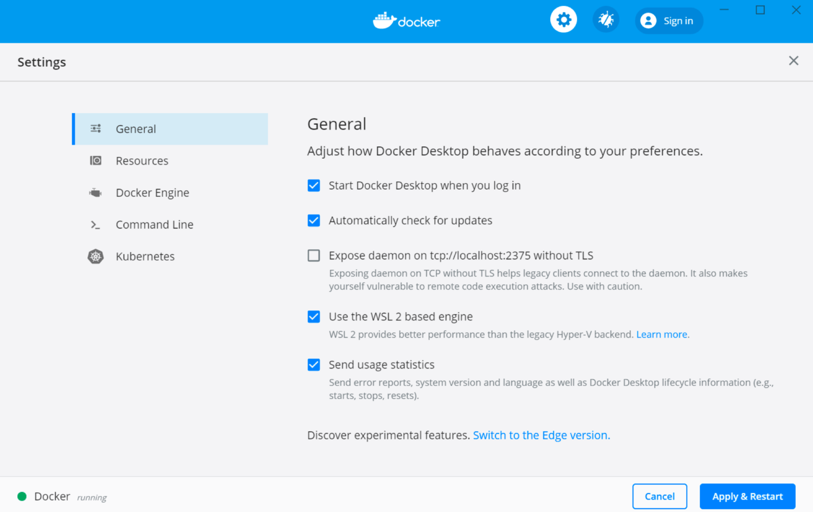

# 사전 준비


## 1. 실습 환경 준비(개인PC)


### 1) mobaXterm 설치

KT cloud 서버에 ssh 접근을 위한 터미널이 필요하다. 

다양한 터미널(putty 등)이 있지만 본 실습에서는 mobax term 이라는 free 버젼 솔루션을 사용한다.

- 참고 : https://inpa.tistory.com/entry/MobaXterm-%F0%9F%92%BD-%EB%AA%A8%EB%B0%94%EC%97%91%EC%8A%A4%ED%85%80-%EC%84%A4%EC%B9%98-%ED%95%9C%EA%B8%80%ED%99%94-SSH-%EC%A0%91%EC%86%8D-%EB%B0%A9%EB%B2%95-%F0%9F%92%AF-%EC%A0%95%EB%A6%AC
  
- download 위치
  - 링크: https://download.mobatek.net/2312023031823706/MobaXterm_Installer_v23.1.zip

- mobaxterm 실행


### 2) gitbash 설치

다운로드 주소 : https://github.com/git-for-windows/git/releases/download/v2.41.0.windows.3/Git-2.41.0.3-64-bit.exe

참조 링크 : https://git-scm.com/


### 3) wsl2 설치

* 참고 : https://gaesae.com/161

k3s, istio, 설치는 Cluster 당 한번만 가능하다. 그러므로 이러한 설치실습은 본인 PC 에 WSL2(Windows Subsystems for Linux 2) 에서 진행할 예정이다.

본인 PC 에 WSL2가 설치되어 있는지 확인하자.


#### (1) 확인하는 방법

command 창에서 wsl 명령으로 설치여부를 확인 할 수 있다.

```sh
> wsl -l -v
  NAME                   STATE           VERSION
* Ubuntu                 Running         2
  docker-desktop-data    Stopped         2
  docker-desktop         Stopped         2
```


#### (2) WSL 신규 설치

- 설치되어 있지 않다면 아래와 같이 설치한다.

```sh
$ wsl --install -d Ubuntu
   <-- 약 10분정도 소요됨.
    
# windows 재기동 시도
# 재기동 되는 과정에서 windows update 수행

# wsl 설치가 마무리되는 시점에 사용자 계정을 입력필요
# 사용자 계정 및 암호 생성
user: xxxx
pass: xxxx
```

​    

- 만약 wsl version 이 1 로 설치되어 있다면 아래를 참조하여 wsl2로 update 수행
  - 참고링크
    - https://docs.microsoft.com/en-us/windows/wsl/install
    - https://docs.microsoft.com/ko-kr/windows/wsl/install-manual
  - PowerShell 에서 실행

```sh
$ wsl --install

$ wsl --set-version Ubuntu 2

# 기본값으로 설정 변경해도 됨
$ wsl --set-default-version 2

# 강제 재기동
$ wsl -t Ubuntu

```


#### (3) WSL 실행하는 방법

실행하는 방법은 아래와 같이 다양하다.  본인에게 편한 방법을 선택하면 되지만 mobaxterm 을 사용하는 것을 추천한다.


##### mobaxterm 에서 실행

* session > WSL 실행


##### cmd 창에서 바로 실행

- cmd 창에서 `wsl` 명령을 입력하면 바로 default linux 가 실행된다.
- `wsl --update`를 이용하여 최신 버전으로 업데이트를 수행할 수 있다.
- `wsl -u root` 명령으로 root 로 실행 할 수 있다.


* root 계정 Password 변경

  ```sh
  $ passwd
  new passwd : ****
  again passwd : ****
  
  ```

  


##### windows 터미널로 실행하는 방법

- windows 터미널 설치 : https://docs.microsoft.com/ko-KR/windows/terminal/get-started

  


#### (4) 실습자료 downoad

wsl 접속 하는데 문제가 없다면 테스트를 위해서 github 에서 실습 자료를 받아 놓자. 

```sh
# root 접속
## githubrepo directory 생성
$ mkdir ~/githubrepo

$ cd ~/githubrepo

$ git clone https://github.com/ssongman/ktds-edu-k8s-istio.git
Cloning into 'ktds-edu-k8s-istio'...
remote: Enumerating objects: 92, done.
remote: Counting objects: 100% (92/92), done.
remote: Compressing objects: 100% (79/79), done.
remote: Total 92 (delta 12), reused 88 (delta 12), pack-reused 0
Receiving objects: 100% (92/92), 2.94 MiB | 3.61 MiB/s, done.
Resolving deltas: 100% (12/12), done.


$ ll ~/githubrepo
total 12
drwxr-xr-x 3 song song 4096 May 14 01:59 ./
drwxr-x--- 5 song song 4096 May 14 01:59 ../
drwxr-xr-x 7 song song 4096 May 14 01:59 ktds-edu-k8s-istio/

```

#### (5) JDK 17 설치

* https://adoptium.net/temurin/releases/


#### (6) STS 설치

* https://download.springsource.com/release/STS4/4.19.1.RELEASE/dist/e4.28/spring-tool-suite-4-4.19.1.RELEASE-e4.28.0-win32.win32.x86_64.self-extracting.jar


### 4) docker desktop 설치

Container 와 kubernetes 의 차이를 이해하기 위해서 간단한 container 배포 테스트를 진행한다.


#### (1) docker destktop 확인

우측 하단  docker desktop  아이콘에서 우클릭후 아래 그림 처럼 Docker Desktop is running 확인


#### (2) docker destktop install

설치되어 있지 않으면 아래와 같이 설치한다.

- 설치 가이드 위치
  - 링크: https://docs.docker.com/desktop/windows/install/


#### (3) docker daemon 확인

wsl terminal(or docker 가 실행가능 곳)에서 아래와 같이 version 을 확인하자.

```sh
$ docker version
Client: Docker Engine - Community
 Cloud integration: v1.0.31
 Version:           23.0.5
 API version:       1.42
 Go version:        go1.19.8
 Git commit:        bc4487a
 Built:             Wed Apr 26 16:17:45 2023
 OS/Arch:           linux/amd64
 Context:           default

Server: Docker Desktop
 Engine:
  Version:          23.0.5
  API version:      1.42 (minimum version 1.12)
  Go version:       go1.19.8
  Git commit:       94d3ad6
  Built:            Wed Apr 26 16:17:45 2023
  OS/Arch:          linux/amd64
  Experimental:     false
 containerd:
  Version:          1.6.20
  GitCommit:        2806fc1057397dbaeefbea0e4e17bddfbd388f38
 runc:
  Version:          1.1.5
  GitCommit:        v1.1.5-0-gf19387a
 docker-init:
  Version:          0.19.0
  GitCommit:        de40ad0  
```

Server version 을 확인할 수 있다면 정상 설치 된 것이다.


#### (4) WSL2에서 도커 데스크탑 실행 설정

도커 데스크탑을 설치하고 설정 페이지의 **General** 탭에서 **Use the WSL2 based engine** 옵션을 체크해준다.

최신 버젼부터는 자동으로 체크되어 있으니 확인만 하자.




도커 데스크탑을 설치하고 정상적으로 설정되어있다면, 바로 WSL2 우분투 터미널에서 도커 명령어를 사용할 수 있다.


### 5) Typora 설치

교육자료(MarkDown 문서)를 typora 로 확인하기를 희망하는 경우 Typora 를 설치한다. 

github site 를 이용하기를 희망한다면 굳이 설치하지 않아도 된다.

하지만  gcp vm 접속을 위한 key 가 필요하므로 아래 git clone 은 수행하도록 하자.


#### (1) Typora 설치

- download 위치
  - 링크: https://typora.io/

- Typora 실행


#### (2) 교육자료 download

github 에서 교육 자료를 download 하자.

* 

```sh
## githubrepo directory 생성
$ mkdir c:\githubrepo

$ cd c:\githubrepo

$ git clone https://github.com/ssongman/ktds-edu-k8s-istio.git
Cloning into 'ktds-edu-k8s-istio'...
remote: Enumerating objects: 92, done.
remote: Counting objects: 100% (92/92), done.
remote: Compressing objects: 100% (79/79), done.
remote: Total 92 (delta 12), reused 88 (delta 12), pack-reused 0
Receiving objects: 100% (92/92), 2.94 MiB | 3.61 MiB/s, done.
Resolving deltas: 100% (12/12), done.

$ dir c:\githubrepo
2023-05-07  오후 09:52    <DIR>          .
2023-05-07  오후 09:52    <DIR>          ktds-edu-k8s-istio

```


#### (3) 교육자료 실행

typora 를 실행하여 c:\githubrepo\ktds-edu-k8s-istio/README.md  를 load 한다.


### 4) 실습자료 download

접속 완료 하였다면 테스트를 위해서 git clone 으로 실습 자료를 받아 놓자.

```sh
# 본인 Namespace 명으로 변경
$ cd ~/users/yjsong

## githubrepo directory 생성
$ mkdir -p ~/users/yjsong/githubrepo

$ cd ~/users/yjsong/githubrepo

$ git clone https://github.com/ssongman/ktds-edu-k8s-istio.git
Cloning into 'ktds-edu-k8s-istio'...
remote: Enumerating objects: 69, done.
remote: Counting objects: 100% (69/69), done.
remote: Compressing objects: 100% (55/55), done.
remote: Total 69 (delta 15), reused 62 (delta 11), pack-reused 0
Unpacking objects: 100% (69/69), 1.63 MiB | 4.09 MiB/s, done.

$ ll ~/users/yjsong/githubrepo
drwxrwxr-x 7 ktdseduuser ktdseduuser 4096 May 13 17:36 ktds-edu-k8s-istio/

$ cd ~/users/yjsong/githubrepo/ktds-edu-k8s-istio/
```

